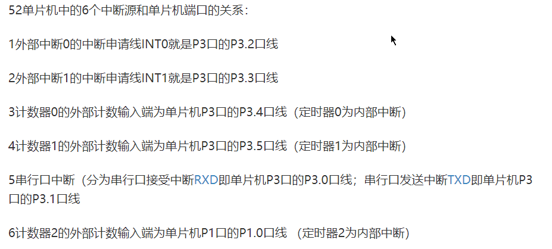

## C52引脚图


## 数据类型

sfr：特殊功能寄存器，对于51，其特殊功能寄存器分布在80H ~ FFH之间。sfr数据类型占用一个存储单元。如，sfr P1 = 0x90

sfr16：特殊功能寄存器，占用2个内存单元。如，sfr16 DPTR=0x82，低位寄存器在82H，高位在83H。

sbit：是指特殊功能寄存器可寻址位。如，sbit OV=PSW^2

## 数据存储类型

1、data：固定指前面0x00-0x7f的128个RAM，可以用acc直接读写的，速度最快，生成的代码也最小。长度8bit。

2、idata：固定指前面0x00-0xff的256个RAM，其中前128和data的128完全相同，只是因为访问的方式不同。idata是用类似C中的指针方式访问的。（不重要的补充：c中idata做指针式的访问效果很好）长度8bit

3、 xdata：外部扩展RAM，一般指外部0x0000-0xffff空间，用@DPTR访问。长度16bit。

4、 pdata：外部扩展RAM的低256个字节，地址出现在A0-A7的上时读写，@Ri读写。这个比较特殊，而且C51好象有对此BUG，建议少用。长度8bit。

5、code：code的作用是告诉单片机，我定义的数据要放在ROM（程序存储区）里面，写入后就不能再更改。长度16bit。

6、bdata：片内RAM寻址区，位于20H ~ 2FH空间。实质上是DATA中的位寻址区，在这个区中声明变量就可以进行位寻址。长度1bit。

## 一些寄存器

### 1、PSW程序状态寄存器

其中的RS1，RS0

RS1		RS0		所选的4组寄存器

0		0		0区(片内RAM地址00H ~ 07H)

0		1		1区(08H ~ 0FH)

1		0 		2区(10H ~ 17H)

1		1		3区(18H ~ 1FH)

### 2、常用寄存器

TCON	定时器、计数器控制寄存器

TMOD	定时器、计数器工作方式控制

TL0		定时器、计数器0的低字节

TH0		定时器、计数器0的高字节

TL1		定时器、计数器的1低字节

TH1		定时器、计数器1的高字节

SCON	串行控制寄存器

SBUF	串行发送数据缓冲器

IE		中断允许控制寄存器

IP		中断优先级控制寄存器

### 3、其他寄存器

AUXR	辅助寄存器

AUXR1	辅助寄存器

DP0L	数据指着DPTR0低字节

DP0H	数据指针DPTR0高字节

DP1L	数据指着DPTR1低字节

DP1H	数据指针DPTR1高字节

WDTRST 看门狗复位寄存器

## 中断

### C52中断种类



### C52中断优先级


### 中断请求源

INT0：外部中断请求0，外部中断请求信号，低电平或者负跳变有效，中断请求标志IE0。

INT1：外部中断请求1，外部中断请求信号，低电平或者负跳变有效，中断请求标志IE1。

TF0：定时器、计数器T0计数溢出中断请求标志。

TF1：定时器、计数器T1计数溢出中断请求标志。

TI or RI：串行口发送中断请求标志TI或接受中断请求标志RI。

### 中断请求标志寄存器

#### TCON寄存器

作为定时器你、计数器控制寄存器，字节地址88H，**可位寻址**。

|        | D7   | D6   | D5   | D4   | D3   | D2   | D1   | D0   |
| ------ | ---- | ---- | ---- | ---- | ---- | ---- | ---- | ---- |
| TCON   | TF1  | TR1  | TF0  | TR0  | IE1  | IT1  | IE0  | IT0  |
| 位地址 | 8FH  | ——   | 8DH  | ——   | 8BH  | 8AH  | 89H  | 88H  |

1）TF0、TF1：片内定时器T0、T1溢出中断请求标志位。启动定时器T计数后，T的初始值开始加1计数，当计数溢	出时，由硬件自动**置TF（与T0、T1对应，后面亦同，不做说明）为1**，向CPU请求中断。CPU响应中断时，TF由**硬件自动清零**，TF也可由软件清零。																																																				

2）IE0、IE1：外部中断0、1的请求标志位。IE为1，表示对应的外部中断请求了中断。

3）IT0、IT1：选择外部请求中断是电平触发（0）还是跳沿触发（1）。

为电平触发时，加到对应外部中断的引脚的外部请求中断信号为低电平有效，并把对应的IE置为1。转向中断服务程序时，则由**硬件自动将对应的IE清零**。

为跳沿触发时，……………………………………………………………………从高到底的负跳沿有效。………………………………

当51复位后，TCON被清零，5个中断请求源的中断请求标志均为0。

#### 串行口控制寄存器CSON

可位寻址

|        | D7   | D6   | D5   | D4   | D3   | D2   | D1   | D0   |
| ------ | ---- | ---- | ---- | ---- | ---- | ---- | ---- | ---- |
| SCON   | ——   | ——   | ——   | ——   | ——   | ——   | TI   | RI   |
| 位地址 | ——   | ——   | ——   | ——   | ——   | ——   | 99H  | 98H  |

1）TI：串行口发送中断请求标志位。当CPU将1字节的数据写入SBUF时，就启动一帧串行数据的发送，没发送完			 一帧串行数据后，硬件自动将TI自动置1。CPU响应串行口发送中断时，并不能清除TI标志，TI标志必须在中断服务程序中**用代码对齐清零**。

2）RI：串行口接收中断请求标志位。在串行口接受完一个串行数据帧，硬件自动使RI请求标志置1。cpu在响应串行口接受中断时，RI标志并不清零，必须在中断服务程序中**用代码对RI清零**。

**注：**当发送完一帧数据后TI = 1，如果正在发送数据，则TI = 0，等到TI = 1时，则数据发送完了。等数据发送完了，TI自动由硬件置1需要通过代码置0。这就是写串行口发送数据时，会出现下面的代码

```C 
void send (uchar dat) {
	SBUF = dat;
	while (!TI);
	TI = 0;
}
```

#### 中断允许寄存器IE

可位寻址

|        | D7   | D6   | D5   | D4   | D3   | D2   | D1   | D0   |
| ------ | ---- | ---- | ---- | ---- | ---- | ---- | ---- | ---- |
| IE     | EA   | ——   | ET2  | ES   | ET1  | EX1  | ET0  | EX0  |
| 位地址 | AFH  | ——   | ADH  | ACH  | ABH  | AAH  | A9H  | A8H  |

1）EA：中断允许总开控制位。

2）ES：串行口中断允许控制位。

3）ET1：定时器、计数器T1溢出中断允许控制位。

4）ET2：定时器、计数器T2溢出中断运行控制位，只有C52有。

4）EX1：外部中断1中断允许控制位。

5）ET0：定时器、计数器T0溢出中断允许控制位。

6）EX0：外部中断0中断允控制位。

上述的各种中断允许控制位都是1——中断被允许，0——中断被屏蔽。

单片机复位后，IE被清零，所有中断都被禁止。各个中断都可以用代码置1或0。

#### 中断优先级寄存器IP

可位寻址

|        | D7   | D6   | D5   | D4   | D3   | D2   | D1   | D0   |
| ------ | ---- | ---- | ---- | ---- | ---- | ---- | ---- | ---- |
| IP     | ——   | ——   | ——   | PS   | PT1  | PX1  | PT0  | PX0  |
| 位地址 | ——   | ——   | ——   | BCH  | BBH  | BAH  | B9H  | B8H  |

1）PS：串行口中断优先级控制位。

2）PT1：定时器T1中断优先级控制位。

3）PX1：外部中断1中断优先级控制位。

4）PT0：定时器T0中断优先级控制位。

5）PX0：外部中断0中断优先级控制位。

上述所有中断优先级控制位都是，1——高优先级，0——低优先级。

## 定时器、计数器

定时器、计数器以下简称“定计”

都是由高8位与低8位组成的。

### 工作方式寄存器TMOD

用于选择定计的工作模式和工作方式，字节地址89H，不可位寻址。

|      | D7   | D6   | D5   | D4   | D3   | D2   | D1   | D0   |
| ---- | ---- | ---- | ---- | ---- | ---- | ---- | ---- | ---- |
| TMOD | GATE | C/T  | M1   | M0   | GATE | C/T  | M1   | M0   |

D7 ~ D4是T1方式字段，D3 ~ D0是T0方式字段。

各组功能如下：

1）GATE：门控位

0——定计是否计数，仅由控制位TRx（x = 0或1，见TCON寄存去）来控制。

1——定计是否计数，要由外部中断引脚（P3^2、P3^3）上的电平与运行控制位TRx两个条件共同控制。

2）M1、M0工作方式选择位

| M1   | M0   | 工作方式                                              |
| ---- | ---- | ----------------------------------------------------- |
| 0    | 0    | 方式0，为13位定                                       |
| 0    | 1    | 方式1，为16位定计                                     |
| 1    | 0    | 方式2，为8位常数自动重新装载的定计                    |
| 1    | 1    | 方式3，仅适用于T0，此时T0分为2个8位计数器，T1停止计数 |

3）C/T：

1——计数器模式是对P3^4（T0）和P3^5（T1）上的外部脉冲进行计数。

0——定时器模式是对单片机系统时钟信号经过片内12分频后的内部脉冲信号（脉冲信号周期 = 机器周期）计数。

### 控制寄存器TCON

字节地址88H，可位寻址，位地址为88H ~ 8FH

|      | D7   | D6   | D5   | D4   | D3   | D2   | D1   | D0   |
| ---- | ---- | ---- | ---- | ---- | ---- | ---- | ---- | ---- |
| TCON | TF1  | TR1  | TF0  | TR0  | IE1  | IT1  | IE0  | IT0  |

### 工作方式

click [here](http://www.elecfans.com/emb/danpianji/20181105809237.html)

### 定时器定初值计算

通用计算方法

计算时间t，晶振频率f
$$
x = {2}^{16} - t/(\frac{12}{f})
$$
TH = x / 256

TL = x % 256

**解释：**低8位可以存放256个机器周期，每满256次向高8位进1，x / 256表示在高8位存在多少个256次溢出，x % 256就是剩下未满256，放在低8位。

### C52的定时器、计数器T2

16位定计，与之相关的有2个特殊功能寄存器T2CON与T2MOD。

T2有3种工作方式：捕获、自动重新装载（递增或递减计数）和波特率发生器 。这3种模式由T2CON 中的位进行选择。有两个8为寄存器：TH2和TL2 

#### T2CON

字节地址C8H，可位寻址，位地址为C8H ~ CFH

|       | D7   | D6   | D5   | D4   | D3    | D2   | D1   | D0     |
| ----- | ---- | ---- | ---- | ---- | ----- | ---- | ---- | ------ |
| T2CON | TF2  | EXF2 | RCLK | TCLK | EXEN2 | TR2  | C/T2 | CP/RL2 |

1）TF2：T2溢出中断标志，在捕捉方式和自动重装初值方式中计数溢出时置1，对应中断入口002BH，但中断响应后，必须**由软件清0**。在串行口波特率发生器方式中TF2不会置1。

2）EXF2：T2外部中断标志。当EXEN2=1(T2外部中断允许)时，引脚T2EX(P1。1)的负跳变使EXF2=1，CPU响应中断，入口地址002BH；EXF2也必须**由软件清0**。

3）RCLK、TCLK：选择串行口波特率发生器方式。RCLK=1和TCLK=1时，T2的溢出率是串行口发送和接收的时钟;当只有RCLK=1时，T2只是串口的接收时钟;只有 TCLK=1时，T2只是串口的发送时钟。此时忽略CP/RL2位。

4）EXEN2：T2外部中断允许标志。使EXEN2=1，当T2工作在捕捉方式时，引脚T2EX上出现的负跳变使EXF2=1，申请中断，同时TH2、TL2的当前值自动送入RCAP2H、RCAP2L寄存器;如果T2工作在重载初值方式，那么T2EX的负跳变将RCAP2H和RCAP2L的内容自动装入TH2、TL2，同时EXF2=1，申请中断。EXEN2=0时，T2EX引脚上的变化对T2工作无影响。

5）TR2：定时器2启动/停止控制位。

6）C/T2：定时器2的定时器/计数器选择位（在reg52头文件中定义为了C_T2,请注意，下面相同）

7）CP/RL2：自动重装方式和捕捉方式选择(此时RCLK和TCLK应为0)。为0-自动重装方式，为1-捕捉方式。

#### T2MOD

字节地址为C9H，不可位寻址

|       | D7   | D6   | D5   | D4   | D3   | D2   | D1   | D0   |
| ----- | ---- | ---- | ---- | ---- | ---- | ---- | ---- | ---- |
| T2MOD | ——   | ——   | ——   | ——   | ——   | ——   | T2OE | DCEN |

1）T2OE：T2输出的使能位。

2）DCEN：置为1时，允许T2增1减1计数，并由T2EX引脚（P1.1）上的电平决定增还是减1计数。

#### 工作方式

| RCLK+TCLK | CP**/RL2** | TR2  | MODE         |
| --------- | ---------- | ---- | ------------ |
| 0         | 0          | 1    | 16位自重载   |
| 0         | 1          | 1    | 16位捕获     |
| 1         | X          | 1    | 波特率发生器 |
| X         | X          | 0    | 关           |

1）16位自动重装载：

寄存器TH2、TL2是16位加1的计数器，RCAP2H、RCAP2L是存放初值的寄存器（陷阱寄存器）。 可以设置为递增/递减自动重载计数器，并通过DCEN（Down Counter Enable）位来控制其模式。16位自动重装模式中，定时器2可通过C/T2位配置为定时器/计数器，根据外部使能标志位EXEN2的置1和清0，可分为两种情况：

EXEN2=0时，定时器2为16位自动重装的普通定时器，由陷阱寄存器提供重装的值，只需要预设一下即可，可用于定时精度要求高，定时时间长（16位）的情况。

EXEN2=1时，根据递减计数使能位DCEN的置1和清0可分为两种情况：

​		T2MOD=0x00(DCEN=0;默认情况)，与上一种情况相比，此时16位自动重新装载可由外部T2EX的负跳变，和溢出任意一种触发，并都能产生中断。

​		T2MOD=0x01(DCEN=1)，此时允许T2EX控制计数的方向；T2EX=0时，重装的值为0FF和0FF，递减计数与陷阱寄存器预存值相等时，置位TF2产生中断。T2EX=1时；自动重装值为陷阱寄存器中的值，溢出时置位TF2产生中断。

在此方式中，若置EXEN2=1时，除上述功能外，引脚P1。1上的负跳变将RCAP2H、RCAP2L的内容自动装入TH2、TL2使之提前开始重新计数，同时置EXF2=1，申请中断。 

demo：

```c
void initTimer2() {
	T2CON = 0x00;
	T2MOD = 0x00;	
	TH2 = RCAP2H = 0xff;		//中断0.1ms
    TL2 = RCAP2L = 0xa4;
	TR2 = 1;	//开启定时器2
}
```

2）波特率发生器：

T2CON的TCLK和RCLK位为0（默认）时，串行口发送和接受的波特率由定时器1提供；置位为1时，由定时器2提供。可以一个通过定时器1，一个通过定时器2，这样可以获得发送和接受时不同的波特率。 

**注：**

定时器2作为定时器时，递增频率为晶振频率的12分频，而定时器2作为波特率发生器时，它的递增频率为晶振频率的2分频。

模式1和模式3的波特率 =（振荡器频率/32）* （65535 - N）

定时器2为计数模式时，外部时钟信号由T2（P1^0）引脚进入。

定时器2作为波特率发生器的时候，TH2溢出并不会置位TF2，所以此时可以不用禁止定时器2中断，若是EXEN2位被置位时，可以将T2EX作为附加的外部中断。

定时器2作为波特率发生器的时候，不要对TH2和TL2读写，可以读陷阱寄存器，但是也不要写。当对定时器2的陷阱寄存器进行访问时，应关闭定时器（TR2清0）。

demo

```C
void initSerial()
{
    RCAP2L = 0xD9; //9600波特率对应 FFD9，低位为D9
    RCAP2H = 0xFF; //高位为FF
    T2CON = 0x34;  //RCLK、TCLK、TR2置1
    SCON = 0x50;   //串口工作模式1，接收使能
    ES = 1;        //打开接收中断
    EA = 1;        //打开总中断
}
```


## 串行口

### 串行口控制寄存器CSON

字节地址98H，可位寻址，位地址98H ~ 9FH，所有位都可用软件来置0或1。

|        | D7   | D6   | D5   | D4   | D3   | D2   | D1   | D0   |
| ------ | ---- | ---- | ---- | ---- | ---- | ---- | ---- | ---- |
| SCON   | SM0  | SM1  | SM2  | REN  | TB8  | RB8  | TI   | RI   |
| 位地址 | 9FH  | 9EH  | 9DH  | 9CH  | 9BH  | 9AH  | 99H  | 98H  |

1）SM0、SM1串行口4种工作方式选择位。

| SM0  | SM 1 | 工作方式                                       |
| ---- | ---- | ---------------------------------------------- |
| 0    | 0    | 方式0，同步移位寄存器方式（用于扩展IO口）      |
| 0    | 1    | 方式1，8位异步收发，波特率可变（由定时器控制） |
| 1    | 0    | 方式2，9位异步收发，波特率为f/64或f/32         |
| 1    | 1    | 方式3，9位异步收发，波特率可变（由定时器控制） |

2）REN：允许串行接收位，由代码置0或1。

1——允许串行口接收数据，0——禁止串行口接收数据。

### 特殊功能寄存器PCON

字节地址87H，不能位寻址

|      | D7   | D6   | D5   | D4   | D3   | D2   | D1   | D0   |
| ---- | ---- | ---- | ---- | ---- | ---- | ---- | ---- | ---- |
| PCON | SMOD | ——   | ——   | ——   | GF1  | GF0  | PD   | IDL  |

SMOD：波特率选择位

方式1的波特率计算公式
$$
方式1波特率=\frac{{2}^{SMOD}}{32} * 定时器T1的溢出率
$$
当SMOD = 1时，要比SMOD = 0的波特率加倍。

### 波特率计算

方式0和方式2这里不提。

方式1或者方式3，常用定时器T1作为波特率发生器，关系式为：
$$
波特率=\frac{{2}^{SMOD}}{32} * 定时器T1的溢出率
$$
实际设定波特率时，用定时器方式2（自动装初值）确定波特率比较好。TL1作为8位计数器，TH1存放备用初值。

设T1方式2的初值为x，则
$$
波特率=\frac{{2}^{SMOD}}{32} * (f / 12) /  (256 - x)
$$
T1产生的常用波特率

| 波特率 | f（晶振频率） | SMOD位 | 方式 | 初值x |
| ------ | :------------ | ------ | ---- | ----- |
| 62500  | 12            | 1      | 2    | FFH   |
| 19200  | 11.0592       | 1      | 2    | FDH   |
| 9600   | 11.0592       | 0      | 2    | FDH   |
| 4800   | 11.0592       | 0      | 2    | FAH   |
| 2400   | 11.0592       | 0      | 2    | F4H   |
| 1200   | 11.0592       | 0      | 2    | E8H   |

