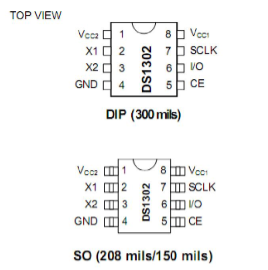
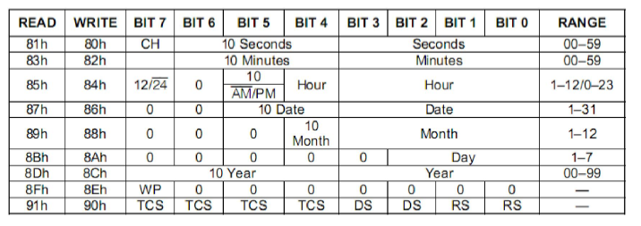
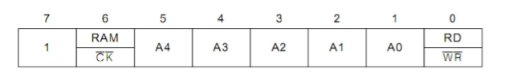
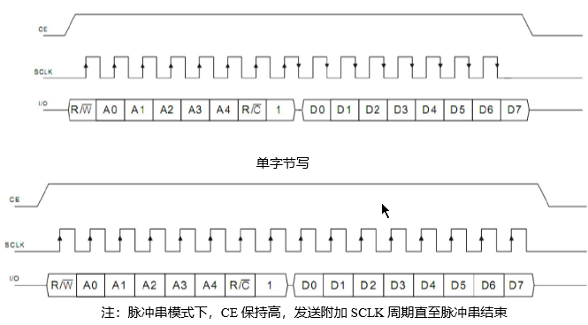

# DS1302时钟芯片

## 引脚



X1 X2 32.768KHz 晶振管脚

GND 地

Vcc1,Vcc2 电源供电管脚 CE 复位脚

I/O 数据输入 / 输出引脚

SCLK 串行时钟

**各引脚功能**

Vcc1 ：主电源；Vcc2 ：备份电源。 当Vcc2>Vcc1+0.2V 时，由Vcc2向DS1302 供电，当 Vcc2< Vcc1 时，由 Vcc1 向DS1302 供电。

SCLK：串行时钟，输入，控制数据的输入与输出；

I/O ：三线接口时的双向数据线；

CE：输入信号，**在读、写数据期间，必须为高，操作结束后，置低电平**。该引脚有两个功能：第一， CE开始控制字访问移位寄存器的控制逻辑；其次，CE 提供结束单字节或多字节数据传输的方法。

**与单片机连接**

。DS1302 与单片机的连接也仅需要 3 条线：CE 引脚、 SCLK 串行时钟引脚、I/O 串行数据引脚， Vcc2 为备用电源， 外接 32.768kHz 晶振，为芯片提供计时脉冲。

## 寄存器

DS1302的寄存器（读时81h～8Dh，写时80h～8Ch）是存放秒、分，小时、日、月、年、周数据的，存放的数据格式为BCD码形式。它的内部时间寄存器如下表：



　　上表是DS1302内部的7个与时间、日期有关的寄存器图和一个写保护寄存器，我们要做的就是将初始设置的时间、日期数据写入这几个寄存器，然后再不断地读取这几个寄存器来获取实时时间和日期。现对这几个寄存器的说明如下：

　　①、秒寄存器（81h、80h）的位7定义为时钟暂停标志（CH）。当初始上电时该位置为1，时钟振荡器停止，DS1302处于低功耗状态；只有**将秒寄存器的该位置改写为0时，时钟才能开始运行**，一般我们在用的时候是在设置时间完成后把秒寄存器写入0，这样就启动了芯片的计时功能。

　　②、小时寄存器（85h、84h）的位7定义为DS1302是运行于12小时模式还是24小时模式。当为**1**时，选择**12小时**模式，为**0**时选择**24小时**模式。在12小时模式时，位5是标志位 ，为0时表示AM，为1时表示PM。在24小时模式时，位5是第二个10小时位。

　　③、控制寄存器（8Fh、8Eh）的位7是写保护位（WP），其它7位均置为0。在任何的时候对时钟和**RAM的写**操作之前，**WP位必须为0**。当WP位为1时，写保护位防止对任一寄存器的写操作。也就是说在电路上电的初始态WP是1，这时是不能改写上面任何一个时间寄存器的，只有首先将WP改写为0，才能进行其它寄存器的写操作。

　　其余的寄存器没有什么特殊的说明。对于DS1302芯片还有一个控制字，该控制字控制这芯片的读写操作。具体的内容如下：



　　如上表所示，位0就是读写位，当位0为1时，就是告诉DS1302，下面是进行读出操作，而当位0为0时就是写入操作。

　　位0－位5是要进行操作的DS1302寄存器地址。

　　位6就是告诉DS1302，是要对RAM进行操作还是对时间寄存器进行操作，0就是对时间寄存器操作，一般我们都是对时间寄存器进行操作。

　　位7就是固定的1。

　　现在就知道为什么控制字80H是写秒寄存器，而81H是读秒寄存器了吧。80H换成二进制就是10000000。而81H的二进制就是10000001，一个是写操作，另一个是读操作嘛！

## 操作步骤

1）首先要通过8eH将写保护去掉，这样我们才能将日期，时间的初值写时各个寄存器。

2）然后就可以对80H、82H、84H、86H、88H、8AH、8CH进行初值的写入。同时也通过秒寄存器将位7的CH值改成0，这样DS1302就开始走时运行了。

3）将写保护寄存器再写为80H，防止误改写寄存器的值。

4）不断读取80H－8CH的值，将他们转化为十进制后显示出来就可以啦，之前我们说过，DS1302读出的数据是BCD码，所以需要转换一下。



DS1302的数据读写是通过I/O串行进行的。当进行一次读写操作时最少得读写两个字节，**第一个字节是控制字节**，就是一个命令，告诉DS1302是读还是写操作，是对RAM还是对CLOK寄存器操作，以及操作的地址。**第二个字节就是要读或写的数据**了。

　　我们先看单字节写：在进行操作之前先得将CE（也可说是RST）置高电平，然后单片机将控制字的位0放到I/O上，当I/O的数据稳定后，将SCLK置高电平，DS1302检测到SCLK的上升沿后就将I/O上的数据读取，然后单片机将SCLK置为低电平，再将控制字的位1放到I/O上，如此反复，将一个字节控制字的8个位传给DS1302。接下来就是传一个字节的数据给DS1302，当传完数据后，单片机将CE置为低电平，操作结束。

　　单字节读操作的一开始写控制字的过程和上面的单字节写操作是一样，但是单字节读操作在写控制字的最后一个位，SCLK还在高电平时，DS1302就将数据放到I/O上，单片机将SCLK置为低电平后数据锁存，单机机就可以读取I/O上的数据。如此反复，将一个字节的数据读入单片机。读与写操作的不同就在于，写操作是在SCLK低电平时单片机将数据放到IO上，当SCLK上升沿时，DS1302读取。而读操作是在SCLK高电平时DS1302放数据到IO上，将SCLK置为低电平后，单片机就可从IO上读取数据。

　　在单字节读操作时，在写控制字的最后一个位也就是位7时，DS1302已将它的寄存器数据位0放到IO上了，要是控制字的位7是0的话，DS1302就无法将它的随后的数据放到IO上了，所以控制字的7位为固定的1，原因在这里哦。

## 示例代码

ds1302.h

现象：下载程序后，数码管显示时钟数据

```C
#ifndef __DS1302_H_
#define __DS1302_H_

//---包含头文件---//
#include<reg51.h>
#include<intrins.h>

//---重定义关键词---//
#ifndef uchar
#define uchar unsigned char
#endif

#ifndef uint 
#define uint unsigned int
#endif

//---定义ds1302使用的IO口---//
sbit DSIO=P3^4;
sbit RST=P3^5;
sbit SCLK=P3^6;

//---定义全局函数---//
void Ds1302Write(uchar addr, uchar dat);
uchar Ds1302Read(uchar addr);
void Ds1302Init();
void Ds1302ReadTime();

//---加入全局变量--//
extern uchar TIME[7];	//加入全局变量
```

ds1302.c

```C
#include"ds1302.h"
//---DS1302写入和读取时分秒的地址命令---//
//---秒分时日月周年 最低位读写位;-------//
uchar code READ_RTC_ADDR[7] = {0x81, 0x83, 0x85, 0x87, 0x89, 0x8b, 0x8d}; 
uchar code WRITE_RTC_ADDR[7] = {0x80, 0x82, 0x84, 0x86, 0x88, 0x8a, 0x8c};
//---DS1302时钟初始化2016年5月7日星期六12点00分00秒。---//
//---存储顺序是秒分时日月周年,存储格式是用BCD码---//
uchar TIME[7] = {0, 0, 0x12, 0x07, 0x05, 0x06, 0x16};

/*函数功能		   : 向DS1302命令（地址+数据）
输    入         : addr,dat*/
void Ds1302Write(uchar addr, uchar dat)
{
	uchar n;
	RST = 0;
	_nop_();

	SCLK = 0;//先将SCLK置低电平。
	_nop_();
	RST = 1; //然后将RST(CE)置高电平。
	_nop_();

	for (n=0; n<8; n++)//开始传送八位地址命令
	{
		DSIO = addr & 0x01;//数据从低位开始传送
		addr >>= 1;
		SCLK = 1;//数据在上升沿时，DS1302读取数据
		_nop_();
		SCLK = 0;
		_nop_();
	}
	for (n=0; n<8; n++)//写入8位数据
	{
		DSIO = dat & 0x01;
		dat >>= 1;
		SCLK = 1;//数据在上升沿时，DS1302读取数据
		_nop_();
		SCLK = 0;
		_nop_();	
	}	
	RST = 0;//传送数据结束
	_nop_();
}

/*函数功能		   : 读取一个地址的数据
*输    入         : addr
*输    出         : dat*/
uchar Ds1302Read(uchar addr)
{
	uchar n,dat,dat1;
	RST = 0;
	_nop_();

	SCLK = 0;//先将SCLK置低电平。
	_nop_();
	RST = 1;//然后将RST(CE)置高电平。
	_nop_();

	for(n=0; n<8; n++)//开始传送八位地址命令
	{
		DSIO = addr & 0x01;//数据从低位开始传送
		addr >>= 1;
		SCLK = 1;//数据在上升沿时，DS1302读取数据
		_nop_();
		SCLK = 0;//DS1302下降沿时，放置数据
		_nop_();
	}
	_nop_();
	for(n=0; n<8; n++)//读取8位数据
	{
		dat1 = DSIO;//从最低位开始接收
		dat = (dat>>1) | (dat1<<7);
		SCLK = 1;
		_nop_();
		SCLK = 0;//DS1302下降沿时，放置数据
		_nop_();
	}

	RST = 0;
	_nop_();	//以下为DS1302复位的稳定时间,必须的。
	SCLK = 1;
	_nop_();
	DSIO = 0;
	_nop_();
	DSIO = 1;
	_nop_();
	return dat;	
}
/* 函 数 名         : Ds1302Init
函数功能		   : 初始化DS1302.*/
void Ds1302Init()
{
	uchar n;
	Ds1302Write(0x8E,0X00);		 //禁止写保护，就是关闭写保护功能
	for (n=0; n<7; n++)//写入7个字节的时钟信号：分秒时日月周年
	{
		Ds1302Write(WRITE_RTC_ADDR[n],TIME[n]);	
	}
	Ds1302Write(0x8E,0x80);		 //打开写保护功能
}

/* 函 数 名         : Ds1302ReadTime
* 函数功能		   : 读取时钟信息*/
void Ds1302ReadTime()
{
	uchar n;
	for (n=0; n<7; n++)//读取7个字节的时钟信号：分秒时日月周年
	{
		TIME[n] = Ds1302Read(READ_RTC_ADDR[n]);
	}		
}
```

main.c

```C
#include "reg52.h"			
#include"ds1302.h"	

typedef unsigned int u16;	 
typedef unsigned char u8;
#define display P0
sbit LSA=P2^2;
sbit LSB=P2^3;
sbit LSC=P2^4;

char num=0;
u8 DisplayData[8];
u8 code 7SEG[10]={0x3f,0x06,0x5b,0x4f,0x66,0x6d,0x7d,0x07,0x7f,0x6f};

/* 函数功能		   : 延时函数，i=1时，大约延时10us*/
void delay(u16 i)
{
	while(i--);	
}


/* 函数功能		   : 时间读取处理转换函数*/
void datapros() 	 
{
   	Ds1302ReadTime();
	DisplayData[0] = 7SEG[TIME[2]/16];				//时
	DisplayData[1] = 7SEG[TIME[2]&0x0f];				 
	DisplayData[2] = 0x40;
	DisplayData[3] = 7SEG[TIME[1]/16];				//分
	DisplayData[4] = 7SEG[TIME[1]&0x0f];	
	DisplayData[5] = 0x40;
	DisplayData[6] = 7SEG[TIME[0]/16];				//秒
	DisplayData[7] = 7SEG[TIME[0]&0x0f];
}

/* 函数功能		 :数码管显示函数*/
void DigDisplay()
{
	u8 i;
	for(i=0;i<8;i++)
	{
		switch(i)	 //位选，选择点亮的数码管，
		{
			case(0):
				LSA=0;LSB=0;LSC=0; break;//显示第0位
			case(1):
				LSA=1;LSB=0;LSC=0; break;//显示第1位
			case(2):
				LSA=0;LSB=1;LSC=0; break;//显示第2位
			case(3):
				LSA=1;LSB=1;LSC=0; break;//显示第3位
			case(4):
				LSA=0;LSB=0;LSC=1; break;//显示第4位
			case(5):
				LSA=1;LSB=0;LSC=1; break;//显示第5位
			case(6):
				LSA=0;LSB=1;LSC=1; break;//显示第6位
			case(7):
				LSA=1;LSB=1;LSC=1; break;//显示第7位	
		}
		display=DisplayData[7-i];//发送数据
		delay(100); //间隔一段时间扫描	
		P0=0x00;//消隐
	}		
}

void main()
{	
	Ds1302Init();
	while(1)
	{
		datapros();	 //数据处理函数
		DigDisplay();//数码管显示函数		
	}		
}
```

