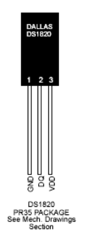
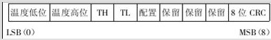
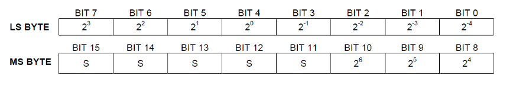
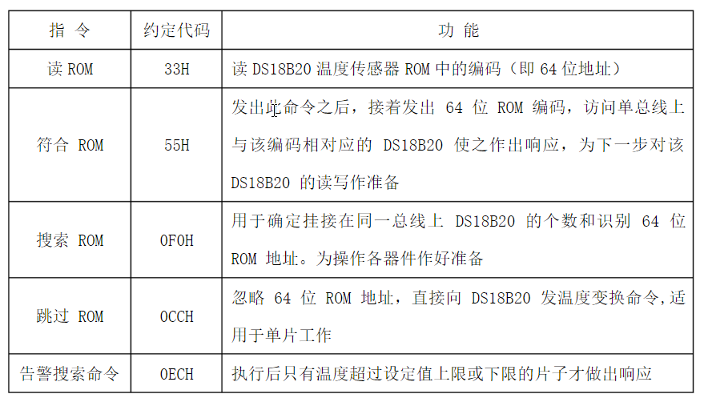
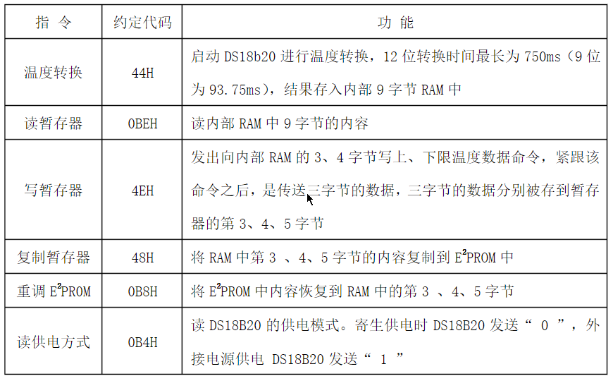

# DS18B20温度传感器

## 引脚



GND – 接地

DQ – 数据输入输出端，也可以为芯片供电

VDD – 可选的外部电源

外部的VDD是可选的，DQ引脚既可以用来传输数据，又可以用来给芯片供电。即在DQ处于高电平时，通过内部集成的电容将能量存储起来，而当DQ处于低电平时，通过内部电容的放电给各模块供电。 

## 内部构成

DS18B20中的温度传感器可完成对温度的测量，以12位转化为例：用16位符号扩展的二进制补码读数形式提供，以0.0625℃/LSB形式表达，其中S为符号位。

这是12位转化后得到的12位数据，存储在DS18B20的两个8bit的RAM中，二进制中的前面5位是符号位，如果测得的温度大于0，这5位为0，只要将测到的数值乘于0.0625即可得到实际温度；如果温度小于0，这5位为1，测到的数值需要取反加1再乘于0.0625即可得到实际温度。**单片机可通过单线接口读到该数据，读取时低位在前，高位在后**。例如：

+125℃的数字输出为07D0H，+25.0625℃的数字输出为0191H，-25.0625℃的数字输出为FE6FH，-55℃的数字输出为FC90H。

 

温度的低八位数据 0 温度的高八位数据 1 高温阀值 2 低温阀值 3 保留 4 保留 5 计数剩余值 6 每度计数值 7 

CRC 校验 8

DS18B20中的温度传感器完成对温度的测量，用16位二进制形式提供，形式表达，其中S为符号位。



温度数据表


## 指令

ROM操作指令



RAM操作指令



## 初始化

1）总线主机发送一复位脉冲（最短为480us的低电平信号）

2）总线主机释放总线，并进入接收方式

3）单线总线经过5K的上拉电阻被拉至高电平状态

4）DS18B20在I/O引脚上检测到上升沿之后，等待15-60us，接着发送存在脉冲（60us-240us的低电平信号）

## 示例代码

现象：下载程序后，在温度传感器接口处，按照丝印方向插好温度传感器，数码管就会显示检测的温度值。

DS18B20.h

```C
#ifndef __TEMP_H_
#define __TEMP_H_

#include<reg52.h>
#ifndef uchar
#define uchar unsigned char
#endif

#ifndef uint 
#define uint unsigned int
#endif

sbit DSPORT=P3^7;

void Delay1ms(uint );
uchar Ds18b20Init();
void Ds18b20WriteByte(uchar com);
uchar Ds18b20ReadByte();
void  Ds18b20ChangTemp();
void  Ds18b20ReadTempCom();
int Ds18b20ReadTemp();

#endif
```

ds18b20.c

```C
#include"temp.h"
/* 函 数 名         : Delay1ms*/
void Delay1ms(uint y)
{
	uint x;
	for( ; y>0; y--)
	{
		for(x=110; x>0; x--);
	}
}
/* 函数功能		   : 初始化
* 输    出         : 初始化成功返回1，失败返回0*/

uchar Ds18b20Init()
{
	uchar i;
	DSPORT = 0;			 //将总线拉低480us~960us
	i = 70;	
	while(i--);//延时642us
	DSPORT = 1;			//然后拉高总线，如果DS18B20做出反应会将在15us~60us后总线拉低
	i = 0;
	while(DSPORT)	//等待DS18B20拉低总线
	{
		Delay1ms(1);
		i++;
		if(i>5)//等待>5MS
		{
			return 0;//初始化失败
		}
	}
	return 1;//初始化成功
}

/* 函数功能		   : 向18B20写入一个字节*/
void Ds18b20WriteByte(uchar dat)
{
	uint i, j;

	for(j=0; j<8; j++)
	{
		DSPORT = 0;	     	  //每写入一位数据之前先把总线拉低1us
		i++;
		DSPORT = dat & 0x01;  //然后写入一个数据，从最低位开始
		i=6;
		while(i--); //延时68us，持续时间最少60us
		DSPORT = 1;	//然后释放总线，至少1us给总线恢复时间才能接着写入第二个数值
		dat >>= 1;
	}
}
/* 函数功能		   : 读取一个字节*/
uchar Ds18b20ReadByte()
{
	uchar byte, bi;
	uint i, j;	
	for(j=8; j>0; j--)
	{
		DSPORT = 0;//先将总线拉低1us
		i++;
		DSPORT = 1;//然后释放总线
		i++;
		i++;//延时6us等待数据稳定
		bi = DSPORT;	 //读取数据，从最低位开始读取
		/*将byte左移一位，然后与上右移7位后的bi，注意移动之后移掉那位补0。*/
		byte = (byte >> 1) | (bi << 7);						  
		i = 4;		//读取完之后等待48us再接着读取下一个数
		while(i--);
	}				
	return byte;
}
/* 函数功能		   : 让18b20开始转换温度*/
void  Ds18b20ChangTemp()
{
	Ds18b20Init();
	Delay1ms(1);
	Ds18b20WriteByte(0xcc);		//跳过ROM操作命令		 
	Ds18b20WriteByte(0x44);	    //温度转换命令
	//Delay1ms(100);	//等待转换成功，而如果你是一直刷着的话，就不用这个延时了
   
}

/* 函数功能		   : 发送读取温度命令*/
void  Ds18b20ReadTempCom()
{	

	Ds18b20Init();
	Delay1ms(1);
	Ds18b20WriteByte(0xcc);	 //跳过ROM操作命令
	Ds18b20WriteByte(0xbe);	 //发送读取温度命令
}

/* 函数功能		   : 读取温度*/
int Ds18b20ReadTemp()
{
	int temp = 0;
	uchar tmh, tml;
	Ds18b20ChangTemp();			 	//先写入转换命令
	Ds18b20ReadTempCom();			//然后等待转换完后发送读取温度命令
	tml = Ds18b20ReadByte();		//读取温度值共16位，先读低字节
	tmh = Ds18b20ReadByte();		//再读高字节
	temp = tmh;
	temp <<= 8;
	temp |= tml;
	return temp;
}
```

main.c

```C
#include "reg52.h"			 //此文件中定义了单片机的一些特殊功能寄存器
#include"temp.h"	

typedef unsigned int u16;	  //对数据类型进行声明定义
typedef unsigned char u8;

sbit LSA=P2^2;
sbit LSB=P2^3;
sbit LSC=P2^4;


char num=0;
u8 DisplayData[8];
u8 code smgduan[10]={0x3f,0x06,0x5b,0x4f,0x66,0x6d,0x7d,0x07,0x7f,0x6f};

/* 函 数 名         : delay
* 函数功能		   : 延时函数，i=1时，大约延时10us*/
void delay(u16 i)
{
	while(i--);	
}
/* 函数功能		   : 温度读取处理转换函数*/
void datapros(int temp) 	 
{
   	float tp;  
	if(temp< 0)				//当温度值为负数
  	{
		DisplayData[0] = 0x40; 	  //   -
		//因为读取的温度是实际温度的补码，所以减1，再取反求出原码
		temp=temp-1;
		temp=~temp;
		tp=temp;
		temp=tp*0.0625*100+0.5;	
		//留两个小数点就*100，+0.5是四舍五入，因为C语言浮点数转换为整型的时候把小数点
		//后面的数自动去掉，不管是否大于0.5，而+0.5之后大于0.5的就是进1了，小于0.5的就
		//算加上0.5，还是在小数点后面。
 
  	}
 	else
  	{			
		DisplayData[0] = 0x00;
		tp=temp;//因为数据处理有小数点所以将温度赋给一个浮点型变量
		//如果温度是正的那么，那么正数的原码就是补码它本身
		temp=tp*0.0625*100+0.5;	
		//留两个小数点就*100，+0.5是四舍五入，因为C语言浮点数转换为整型的时候把小数点
		//后面的数自动去掉，不管是否大于0.5，而+0.5之后大于0.5的就是进1了，小于0.5的就
		//算加上0.5，还是在小数点后面。
	}
	DisplayData[1] = smgduan[temp / 10000];
	DisplayData[2] = smgduan[temp % 10000 / 1000];
	DisplayData[3] = smgduan[temp % 1000 / 100] | 0x80;
	DisplayData[4] = smgduan[temp % 100 / 10];
	DisplayData[5] = smgduan[temp % 10];
}

void DigDisplay()
{
	u8 i;
	for(i=0;i<6;i++)
	{
		switch(i)	 //位选，选择点亮的数码管，
		{
			case(0):
				LSA=0;LSB=0;LSC=0; break;//显示第0位
			case(1):
				LSA=1;LSB=0;LSC=0; break;//显示第1位
			case(2):
				LSA=0;LSB=1;LSC=0; break;//显示第2位
			case(3):
				LSA=1;LSB=1;LSC=0; break;//显示第3位
			case(4):
				LSA=0;LSB=0;LSC=1; break;//显示第4位
			case(5):
				LSA=1;LSB=0;LSC=1; break;//显示第5位	
		}
		P0=DisplayData[i];//发送数据
		delay(100); //间隔一段时间扫描	
		P0=0x00;//消隐
	}		
}
void main()
{	
	while(1)
	{
		datapros(Ds18b20ReadTemp());	 //数据处理函数
		DigDisplay();//数码管显示函数		
	}		
}
```

