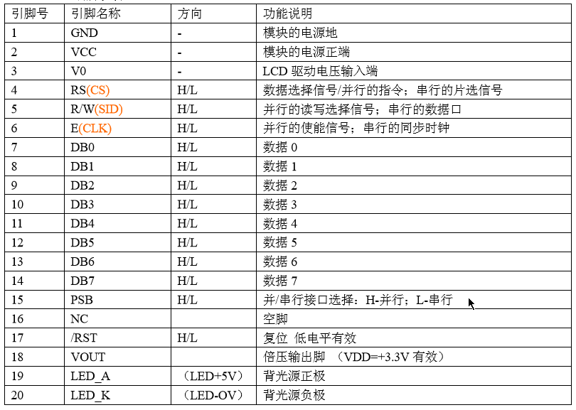
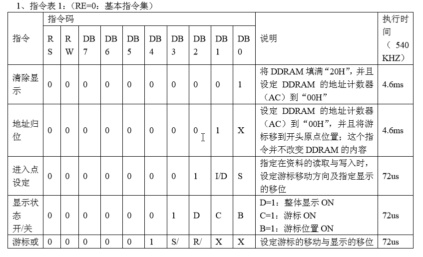
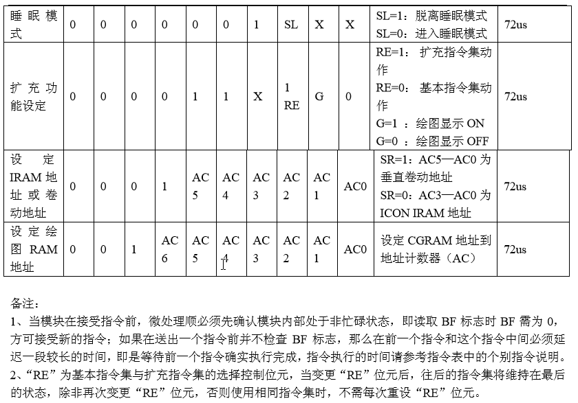

## LCD12864

### 引脚说明



### 12864指令






示例代码

开机第一行显示座位号、第二行显示队名，循环显示3秒

lcd12864.h

```c
//已用端口：P2.5,P2.6,P2.7,P3.2,P3.4,P0
#ifndef __LCD12864_h__
#define __LCD12864_h__

#include<reg52.h>
#include<intrins.h>
#define uchar unsigned char
#define uint unsigned int
#define LCD_DATA P0
sbit LCD_RS=P2^6;
sbit LCD_RW=P2^5;
sbit LCD_EN=P2^7;
sbit LCD_PSB=P3^2;
sbit LCD_RES=P3^4;

/***********延时xms*************
void delay_xms(uint a)
{
  uint i,j;
	for(i=a;i>0;i--)
	for(j=110;j>0;j--);
}
/**************延时1ms***********/
void delay1ms()
{
   unsigned char i,j; 
for(i=0;i<4;i++)
   for(j=0;j<33;j++);//(3j+2)*i=(3×33+2)×10=1010(微秒)，可以认为是1毫秒   
}
/***********延时xms**************************/
void delay_xms(uchar n)
{
   unsigned char i;
for(i=0;i<n;i++)
    delay1ms();
}
/*********判忙*****************/
bit check_busy()
{
  bit busy;
	LCD_RS=0;
	LCD_RW=1;
	LCD_EN=1;
	delay_xms(2);
	busy=(bit)(LCD_DATA&0X80);
	LCD_EN=0;
	return busy;
}
//等待LCD空闲
void wait()
{
  while(check_busy());
}
/*************写指令************/
void write_cmd(uchar cmd)
{
	wait();
  LCD_RS=0;
	LCD_RW=0;
	LCD_EN=0;
	delay_xms(2);
	LCD_DATA=cmd;
	LCD_EN=1;
	delay_xms(2);
	LCD_EN=0;
}
/*************写数据***************/
void write_data(uchar dat)
{
  wait();
	LCD_RS=1;
	LCD_RW=0;
	LCD_EN=0;
	delay_xms(5);
	LCD_EN=1;
	LCD_DATA=dat;
	delay_xms(10);
	LCD_EN=0;
	
}
/***********LCD_12864初始化*************/
void initial_12864()
{
  delay_xms(40);
	LCD_PSB=1;
	delay_xms(1);
	LCD_RES=0;
	delay_xms(1);
	LCD_RES=(1);
	write_cmd(0x30);//基本指令
	delay_xms(10);
	write_cmd(0x0c);//开显示，关光标
	delay_xms(10);
	write_cmd(0x01);//清屏
	delay_xms(10);
}
/***********字符串写入地址**************/
void LCD_POS(uchar X)
{
  uchar pos;
	if(X==0)
	{X=0x80;}
	if(X==1)
	{X=0x90;}
	if(X==2)
	{X=0x88;}
	if(X==3)
	{X=0x98;}
	pos=X;
	write_cmd(pos);
}
/***************字符串写入显示**************/
unsigned char LCD_DISPLAY(uchar x, uchar *DATA)
{
  int i=0;
	LCD_POS(x);
	while(DATA[i]!='\0')
	{
	  write_data(DATA[i]);
		i++;
	}
	return 0;
}
void write_ten_data(uchar add,uint date)
{
  uchar shi,ge;
	shi=date/10;
	ge=date%10;
	write_cmd(add);
	write_data(0x30+shi);
	write_data(0x30+ge);
}
#endif
```

main.c

```c
#include<reg52.h>
#include "LCD12864.h"

#define uchar unsigned char
#define uint  unsigned int

uchar code dis1[] = {"BA079"};
uchar code dis2[] = {"ADD1"};
uchar code dis3[] = {"HFNU"};
uchar code dis4[] = {"合肥师范学院"};

uchar interrupt_count = 0;
bit stop_display = 0;

void delay(int ms)
{
    while(ms--)
	{
      uchar i;
	  for(i=0;i<250;i++)  
	   {
	    _nop_();			   
		_nop_();
		_nop_();
		_nop_();
	   }
	}
}

void timer() interrupt 1 {

	interrupt_count++;
	TH0=0x4c;
	TL0=0x00;
	if(interrupt_count == 60) {
       stop_display=1;
       TR0 = 0;
	  }
}

void init_time0() {
	EA = 1;
	ET0 = 1;
	TMOD = 0x01; //model1
	TH0=0x4c;	//给定时器赋初值，定时50ms
	TL0=0x00;	
	TR0 = 1;
}

void main() {
	uchar row;
	row = 0;
	initial_12864();
	init_time0();
	while(!stop_display){
		LCD_DISPLAY(row, dis1);
		row++;
		if (row == 4) {
			row = 0;
		}
		LCD_DISPLAY(row, dis2);	
		delay(500);
		write_cmd(0x01);
		delay(50);
	}
	while(1);
}
```

