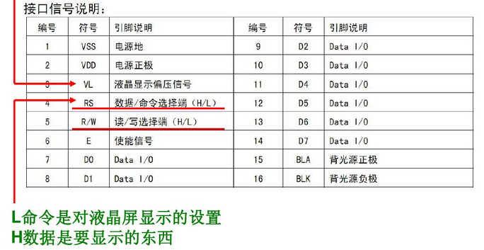
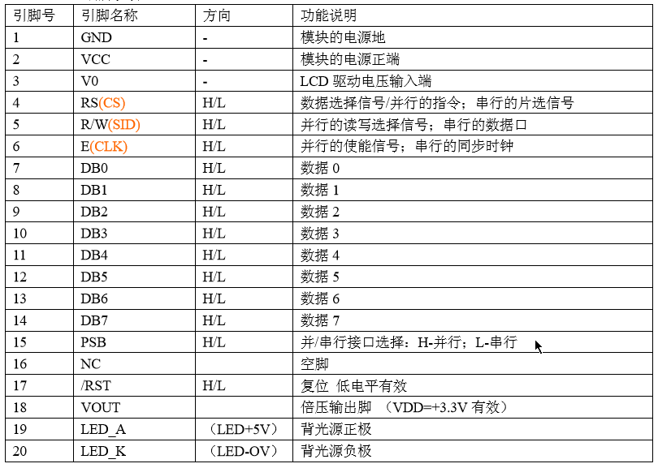
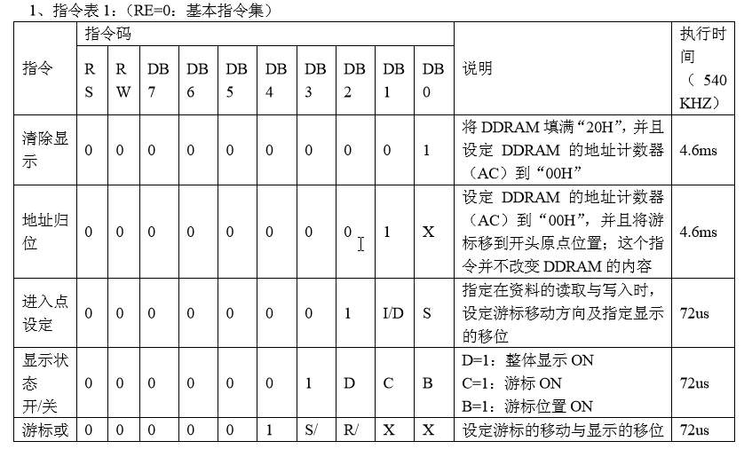
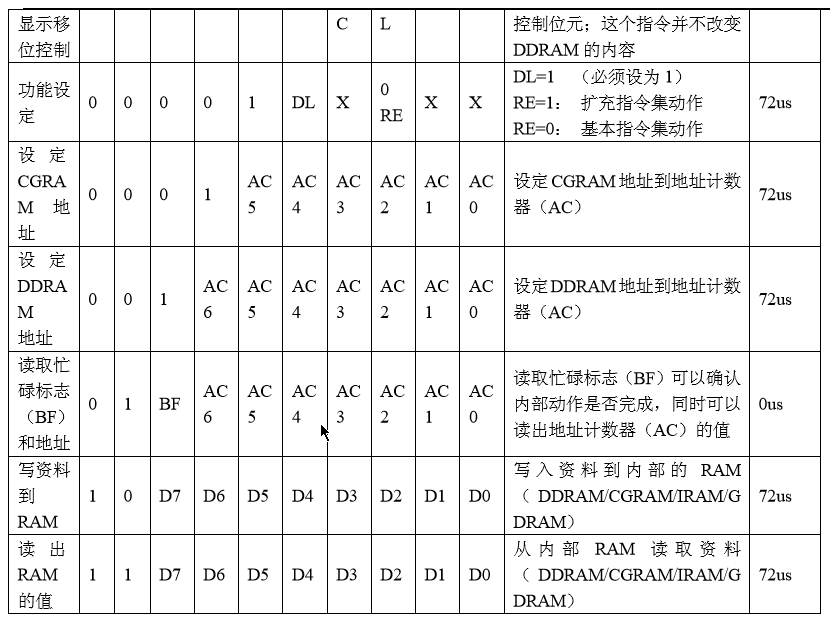
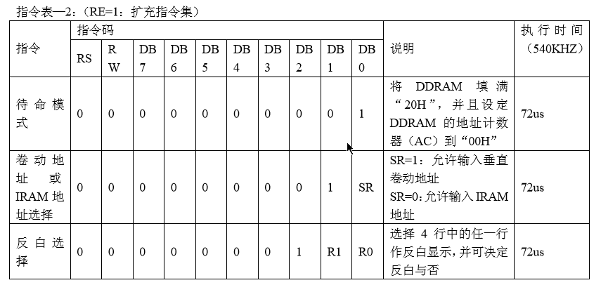
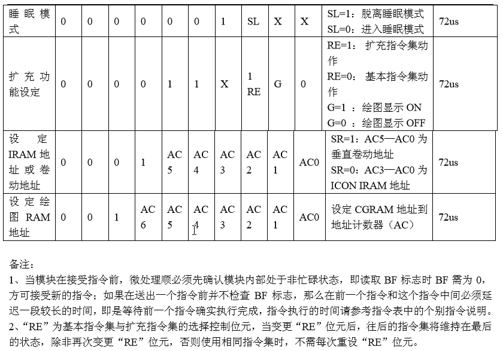

2019.04.23

隔了好久，为了参加比赛，再次拿起51单片机

## LCD1602

### 引脚说明

### 与51连接

数据接线仅供参考

1.直接接地  

2.接VCC 

3.接在一个滑动变阻上再与地相接 。VL为液晶显示器对比度调整端，接正电源时对比度最弱，接地时对比度最高，对比度过高时会产生“鬼影”，使用时可以通过一个10K的电位器调整对比度。

4.接RS->P3.5 。RS为寄存器选择，高电平时选择数据寄存器、低电平时选择指令寄存器。

5.直接接地（因为我们一般都只让液晶屏显示即写入，所以这个单片机原理图直接接地）

6.LCDEN使能端->P3.4。当E端由高电平跳变成低电平时，液晶模块执行命令。

7-14.数据写入->P0

15.接一个电阻后（电阻为了限流，延长LCD的使用寿命也防止烧坏背光灯）与VCC连接（液晶屏背光正极）

16.直接接地（液晶屏背光负极）

### 1602指令

要使1602达到指定的显示效果，首先要对其控制器进行初始化设置，还要对有无光标，光标的移动方向，光标是否闪烁及字符移动方向进行设置。

**指令1：清屏指令。**

（1）清楚液晶显示器，即将DDRAM的内容全部填入空白的ASCII码20H

（2）地址计数器（AC）的值设为0

（3）光标复位到地址00H位置（显示器的左上方）

**指令2：光标复位指令。**

（1）光标返回地址00H

（2）AC值设为0

（3）DDRAM的内容不变

**指令3：光标和显示模式设置。**

设定每次输入1位数据后光标的移位方向，并且设定输入后字符是否移动。

I/D（光标移动方向）：             高(1)：右移          低(0)：左移

S（屏幕上所有文字是否移动）：高 ：有效右移  低：无效，整屏显示不移动

**指令4：显示开关及光标控制。**

控制显示器开/关、光标显示/关闭以及光标是否闪烁

D（控制整体显示的开与关）：高：开显示  低：关显示

C（控制光标的开与关）：       高：有光标  低：无光标

B（控制光标是否闪烁）：       高：闪烁     低：不闪烁

**指令5：光标或字符移位。**           

S/C=1移动显示的字符，S/C=0移动光标

R/L=1右移，R/L=0左移

| S/C（移动文字/标） | R/L  |                                   |
| ------------------ | ---- | --------------------------------- |
| 0                  | 0    | 光标左移1格且AC-1                 |
| 0                  | 1    | 光标右移1格且AC+1                 |
| 1                  | 0    | 显示器上字符全部左移1格但光标不动 |
| 1                  | 1    | 显示器上字符全部右移1格但光标不动 |

**指令6：功能设置命令。**

设定数据总线位数、显示的行数及字型。

DL（传输数据有效位选择控制位）：高：8位数据口     低：4位数据口

N（显示行数）        ：高：2行      低：1行

F（字符显示点阵类型）   ：高：5x7点阵   低：5x10点阵

**指令7：设定CGRAM地址指令。**

设定下一个要存入数据的CGRAM的地址。

**指令8：设定DDRAM地址指令。**

1602内部有一个显示数据的RAM地址指针，用户可以通过它访问内部全部80字节的数据显示RAM。

指令格式：80H+地址码 

其中80H为命令码，地址码决定字符在LCD上的显示位置

设定下一个要存入数据的DDRAM的地址。

**指令9：读取忙信号或AC地址指令。**

（1）读取忙信号BF的内容    

BF（液晶显示器是否忙）：高：忙，暂时无法接收单片机送来的数据或指令   低：可接收

（2）读取地址计数器（AC）的内容

**指令10：数据写入DDRAM或CGRAM指令。**

（1）将字符码写入DDRAM，以使液晶显示屏显示出相对于的字符

（2）使用者自己设计的图形存入CGRAM

**指令11：从CGRAM或DDRAM读出数据的指令。**

读取DDRAM或CGRAM中的内容。

写入命令前都要检查1602是否忙，即BF是否为1

> 16x2显示，5x7点阵，8位数据接口 => 00111000B即38H
>
> 两行显示，开显示，显示光标，光标闪烁 => 00001111B即0FH

### 字符显示位置确定

1602显示数据RAM地址与字符显示位置对应关系

可显示区域           		   隐藏区域

00 01 02 03 04 ........ 0F  10 ........ 27

40 41 42 43 44 ........4F   50 ........ 67

向00H ~ 0FH（第一行）和40H ~ 4FH（第二行）写入数据时，1602会立刻显示出来。

向剩下的区域显示数据时，不会显示，要通过光标或者字符移位命令移动到可现实区域，才能显示。

如果要向40H写入数据，通过命令8来实现，即80H + 40H = C0H

### 复位

上电后的复位状态为：

清除屏幕显示；设置8位数据位长度，单行显示，5x7点阵位；显示屏、光标、闪烁功能均关闭；输入方式为整屏显示不移动，即I/D = 1

一般初始化设置

38H => 显示模式，16x2显示，5x7点阵，8位数据口

0CH => 开显示，不显示光标

05H => 写一个字符后，地址指针加1

01H => 显示清屏，数据指针清零

08H => 显示关闭

### 基本操作

|        | 单片机发送给160的信号                        | 1602的输出       |
| ------ | -------------------------------------------- | ---------------- |
| 读状态 | RS = 0，R/W = 1, E = 1                       | D0 ~ D7 = 状态字 |
| 写命令 | RS = 0，R/W = 0, D0 ~ D7 = 命令， E = 正脉冲 | 无               |
| 读数据 | RS = 1， R/W = 1, E = 1                      | D0 ~ D7 = 数据   |
| 写数据 | RS = 1，R/W = 0，D0 ~ D7 = 数据，E = 正脉冲  | 无               |

[more](http://www.51hei.com/mcu/4327.html)

## LCD12864

### 引脚说明

### 12864指令

