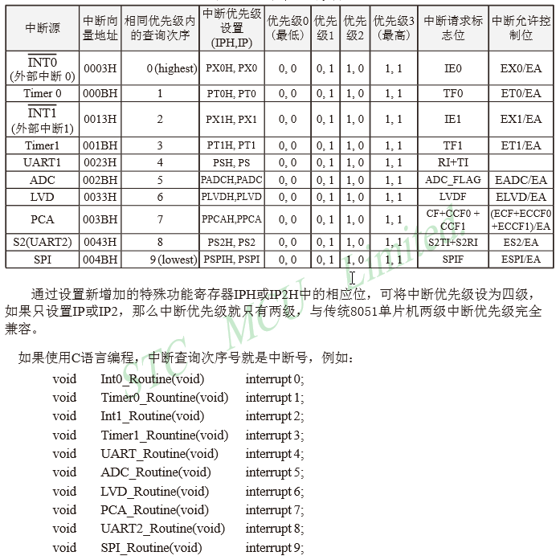
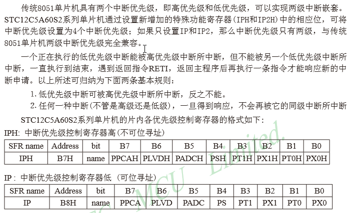

# STC12C5A60S2

## 引脚图&最小系统

## 中断系统

### 中断查询次序

### 中断优先级

### 中断触发行为

### 中断寄存器

#### 中断允许寄存器IE、IE2

#### 中断优先级控制寄存器IP、IP2、IPH、IP2H

例如

#### A/D转换控制寄存器ADC CONTR

## 定时器、计数器

#### 定时器、计数器控制寄存器TCON

TCON为定时器/计数器T0、T1的控制寄存器，同时也锁存T0、T1溢出中断源和外部请求中断源等，TCON格式如下：

TF1：定时器/计数器T1溢出标志。T1被允许计数以后，从初值开始加1计数。当最高位产生溢出时由硬件	置“1”TF1，向CPU请求中断，一直保持到CPU响应中断时，才由硬件清“0”TF1（TF1也可由程序查询清“0”）。

TR1：定时器T1的运行控制位。该位由软件置位和清零。当GATE（TMOD.7）=0，TR1=1时就允许T1开始计数，TR1=0时禁止T1计数。当GATE（TMOD.7）=1，TR1=1且INT1输入高电平时，才允许T1计数。

TF0：定时器/计数器T0溢出中断标志。T0被允许计数以后，从初值开始加1计数，当最高位产生溢出时，由硬件置“1”TF0，向CPU请求中断，一直保持CPU响应该中断时，才由硬件清“0”TF0（TF0也可由程序查询清“0”）。

TR0：定时器T0的运行控制位。该位由软件置位和清零。当GATE（TMOD.3）=0，TR0=1时就允许To开始计数，TR0=0时禁止T0计数。当GATE（TMOD.3）=1，TRO=1且INTO输入高电平时，才允许T0计数。

IE1：外部中断1请求源（INT1/P3.3）标志。IE1=1，外部中断向CPU请求中断，当CPU响应该中断时由硬件清“0”E1。

IT1：外部中断1触发方式控制位。IT1=0时，外部中断1为低电平触发方式，当INT1（P3.3）输入低电平时，置位IE1。采用低电平触发方式时，外部中断源（输入到INT1）必须保持低电平有效，直到该中断被CPU响应，同时在该中断服务程序执行完之前，外部中断源必须被清除（P3.3要变高），否则将产生另一次中断。当IT1=1时，则外部中断1（INT1）端口由“1”→“0”下降沿跳变，激活中断请求标志位IE1，向主机请求中断处理。

IE0：外部中断0请求源（INTO/P3.2）标志。IE0=1外部中断0向CPU请求中断，当CPU响应外部中断时，由硬件清“0”IE0（边沿触发方式）。

IT0：外部中断0触发方式控制位。IT0=0时，外部中断0为低电平触发方式，当INT0（P3.2）输入低电平时，置位I正0。采用低电平触发方式时，外部中断源（输入到INT0）必须保持低电平有效，直到该中断被CPU响应，同时在该中断服务程序执行完之前，外部中断源必须被清除（P3.2要变高），否则将产生另一次中断。当IT0=1时，则外部中断0（INTO）端口由“1”→“0”下降沿跳变，激活中断请求标志位IE1，向主机请求中断处理。

## A/D转换功能

### 与A/D转换相关的寄存器

#### P1口模拟功能控制寄存器P1ASF

需作为A/D使用的口需先将P1ASF特殊功能寄存器中的相应位置为‘1’，将相应的口设置为模拟功能。PlASF寄存器（该寄存器是只写寄存器，读无效）的格式如下：

当P1口中的相应位作为A/D使用时，要将P1ASF中的相应位置1.

#### ADC控制寄存器ADC CONTR

ADC POWER:ADC电源控制位。0：关闭A/D转换器电源；1：打开A/D转换器电源.

SPEED1，SPEEDO：模数转换器转换速度控制位

ADCFLAG：模数转换器转换结束标志位，当A/D转换完成后，ADC_FLAG=1，要由软件清0。
不管是A/D转换完成后由该位申请产生中断，还是由软件查询该标志位A/D转换是否结束，当A/D转换完成后，ADC_FLAG=1，一定要软件清0。

ADC_START：模数转换器（ADC）转换启动控制位，设置为“1”时，开始转换，转换结束后为0.

CHS2/CHS1/CHSO：模拟输入通道选择，CHS2/CHS1/CHSO

#### A/D转换结果寄存器ADC RES、ADC RESL

特殊功能寄存器ADC_RES和ADC_RESL寄存器用于保存A/D转换结果，其格式如下：

AUXR1寄存器的ADRJ位是A/D转换结果寄存器（ADC_RES，ADC_RESL）的数据格式调整控制位.
当ADRJ=0时，10位A/D转换结果的高8位存放在ADC_RES中，低2位存放在ADC_RESL的低2位中。

此时，如果用户需取完整10位结果，按下面公式计算：

如果用户只需取8位结果，按下面公式计算：

式中，Vin为模拟输入通道输入电压，Vcc为单片机实际工作电压，用单片机工作电压作为模拟参考电压。

当ADRJ=1时，10位A/D转换结果的高2位存放在ADC_RES的低2位中，低8位存放在ADC_RESL中。

此时，如果用户需取完整10位结果，按下面公式计算：

### 与A/D中断有关的寄存器

#### IE：中断允许寄存器

可位寻址

EA:CPU的中断开放标志，EA=1，CPU开放中断，EA=0，CPU屏蔽所有的中断申请。EA的作用是使中断允许形成多级控制。即各中断源首先受EA控制；其次还受各中断源自己的中断允许控制位控制。

EADC:A/D转换中断允许位。EADC=1，允许A/D转换中断；EADC=0，禁止A/D转换中断。

如果要允许A/D转换中断则需要将相应的控制位置1：
1、将EADC置1，允许ADC中断，这是ADC中断的中断控制位。
2、将EA置1，打开单片机总中断控制位，此位不打开，也是无法产生ADC中断的A/D中断服务程序中要用软件清A/D中断请求标志位ADC_FLAG（也是A/D转换结束标志位）。

#### IPH：中断优先级控制寄存器高

不可位寻址

#### IP：中断优先级控制寄存器低

可位寻址

PADCH，PADC:A/D转换中断优先级控制位。
当PADCH=0且PADC=0时，A/D转换中断为最低优先级中断（优先级0）

当PADCH=0且PADC=1时，A/D转换中断为较低优先级中断（优先级1）

当PADCH=1且PADC=0时，A/D转换中断为较高优先级中断（优先级2）

当PADCH=1且PADC=1时，A/D转换中断为最高优先级中断（优先级3）