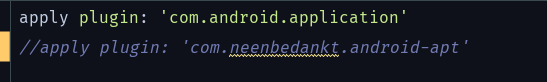
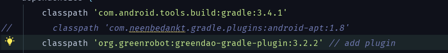

> Unknown failure (at android.os.Binder.execTransact(Binder.java:731)) Error while Installing APKs

出现这个问题的原因，是因为在早期，Android操作系统几乎只支持一种CPU架构：ARMv5。但是现在Android系统目前支持七种不同的CPU体系结构：ARMV5、ARMV7（2010）、X86（2011）、MIPS（2012）、ARMV8、MIPS64和X86Y64（2014）。它们中的每一个都与各自的ABI相关联。所以关于.so文件的处理需要更多的关注。 
解决方法如下： 

在build.gradle(Module:app)文件里面的defaultConfig模块下加入splits这一段就行，如下：

```dsl
defaultConfig {

 splits {
            abi {
                enable true
                reset()
                include 'x86', 'armeabi-v7a','x86_64'
                universalApk true
            }
	}
}
```


> Android resource compilation failed
> Output:  E:\CommonFiles\Projects\AndroidProject\MyApplicatioon\app\src\main\res\layout\activity_radio_test.xml:4: error: not well-formed (invalid token).
>
> Command: D:\AppData\.gradle\caches\transforms-1\files-1.1\aapt2-3.2.1-4818971-windows.jar\c15550d3941767ac27b1c97866e5bf31\aapt2-3.2.1-4818971-windows\aapt2.exe compile --legacy \
>         -o \
>         E:\CommonFiles\Projects\AndroidProject\MyApplicatioon\app\build\intermediates\res\merged\debug \
>         E:\CommonFiles\Projects\AndroidProject\MyApplicatioon\app\src\main\res\layout\activity_radio_test.xml
> Daemon:  AAPT2 aapt2-3.2.1-4818971-windows Daemon #2

出现的原因正如上面提到的“Android resource compilation failed”，出现问题的资源文件是“activity_radio_test.xml”，文件的内容如下

```xml
<?xml version="1.0" encoding="utf-8"?>
<RelativeLayout
    xmlns:android="http://schemas.android.com/apk/res/android"
    :app="http://schemas.android.com/apk/res-auto"
    android:layout_height="match_parent"
    android:layout_width="match_parent"
    android:orientation="vertical">
    <TextView
        android:layout_width="match_parent"
        android:layout_height="wrap_content"
        android:layout_above="@id/sex_group"
        android:text="please choose your sex:"
        android:textSize="9pt"/>
    <RadioGroup
        android:id="@+id/sex_group"
        android:contentDescription="sex"
        android:layout_centerInParent="true"
        android:layout_width="match_parent"
        android:layout_height="wrap_content">
        <RadioButton
            android:id="@+id/sex_man"
            android:text="man"
            android:layout_width="match_parent"
            android:layout_height="wrap_content" />
        <RadioButton
            android:id="@+id/sex_woman"
            android:text="woman"
            android:layout_width="match_parent"
            android:layout_height="wrap_content" />
    </RadioGroup>
    <TextView
    android:id="@+id/show_choice"
    android:text="current choice is None"
    android:layout_width="match_parent"
    android:layout_height="wrap_content"
    android:layout_below="@id/sex_group"
    android:textSize="9pt"/>

</RelativeLayout>
```

问题处在xml文件的开头，应该改成

```xml
<?xml version="1.0" encoding="utf-8"?>
<RelativeLayout
xmlns:android="http://schemas.android.com/apk/res/android"
    xmlns:tools="http://schemas.android.com/tools"
```

> Error:android-apt plugin is incompatible with the Android Gradle plugin. Please use 'annotationProc

1、把module/build.gradle下的apt插件应用全部注释掉



2、把dependencies下的apt全部改为annotationProcessor


3、把project/build.gradle中的apt插件声明注释

