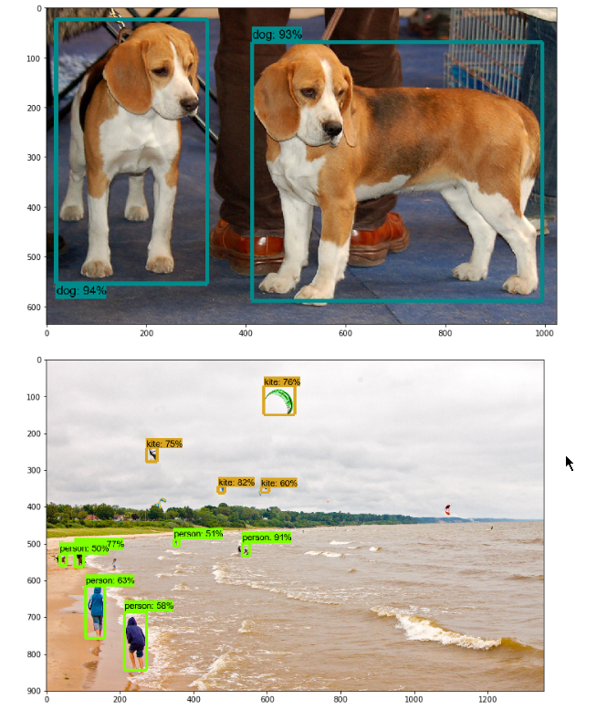

## 安装

实现在anaconda中创建一个用于深度学习的环境，这个环境最好可以用GPU加速。

### 创建深度学习环境

终端中激活深度学习的环境,安装依赖的包

```powershell
activate dl_gpu
pip3 install matplotlib pillow lxml jupyter Cython pandas
```

### 克隆models

```powershell
git clone https://github.com/tensorflow/models.git
```

### 安装protoc

下载https://github.com/protocolbuffers/protobuf/releases

解压到model文件夹下，将bin目录下的exe文件复制到C:/weidows/system32文件夹下。

### 编译proto

进入models\research文件夹下，输入下面命令

```powershell
protoc --python_out=. .\object_detection\protos\anchor_generator.proto .\object_detection\protos\argmax_matcher.proto .\object_detection\protos\bipartite_matcher.proto .\object_detection\protos\box_coder.proto .\object_detection\protos\box_predictor.proto .\object_detection\protos\eval.proto .\object_detection\protos\faster_rcnn.proto .\object_detection\protos\faster_rcnn_box_coder.proto .\object_detection\protos\grid_anchor_generator.proto .\object_detection\protos\hyperparams.proto .\object_detection\protos\image_resizer.proto .\object_detection\protos\input_reader.proto .\object_detection\protos\losses.proto .\object_detection\protos\matcher.proto .\object_detection\protos\mean_stddev_box_coder.proto .\object_detection\protos\model.proto .\object_detection\protos\optimizer.proto .\object_detection\protos\pipeline.proto .\object_detection\protos\post_processing.proto .\object_detection\protos\preprocessor.proto .\object_detection\protos\region_similarity_calculator.proto .\object_detection\protos\square_box_coder.proto .\object_detection\protos\ssd.proto .\object_detection\protos\ssd_anchor_generator.proto .\object_detection\protos\string_int_label_map.proto .\object_detection\protos\train.proto .\object_detection\protos\keypoint_box_coder.proto .\object_detection\protos\multiscale_anchor_generator.proto .\object_detection\protos\graph_rewriter.proto
```

注：这里输入`protoc object_detection/protos/*.proto --python_out=` 会报错

### 安装api

注意，这里首先还是要在终端中输入activate dp-gpu，保证在之前创建的环境下安装api

在models\research目录下，终端输入

```
python setup.py build
```

等待结束后，再输入

```
python setup.py install
```

### 配置该API的python path

```shell
activate tf-gpu
set PYTHONPATH=E:\CommonFiles\git\models;E:\CommonFiles\git\models\research;E:\CommonFiles\git\models\research\slim;E:\CommonFiles\git\models\research\object_detection
```

PYTHONPATH后面的路径是clone的git的路径

### 验证安装结果

打开models\research\object_detection目录，终端中输入

```shell
jupyter notebook object_detection_tutorial.ipynb
```

进入jupyter中，选择cell -> Run all，等待一段时间，出现下面的图，则代表安装成功



## 检测自己的物体

### 安装labelImg

安装所需依赖包

```
pip install PyQt5
pip install pyqt5-tools
```

下载labelImg的压缩文件

```
git clone https://github.com/tzutalin/labelImg.git
```

然后cd 到目标文件夹 ，输入

```
pyrcc4 -o resources.py resources.qrc
```

再输入

```
python labelImg.py
```

启动labelImg

### labelImg使用

略

### 训练自己的数据集

#### 准备训练数据

1、使用LabelImg为待训练的图片做标签，具体怎么使用，我知道，这里就不详细说了。

2、将处理好的图片生成的xml文件转成csv文件，这是代码。

我原本是不同标签的xml、csv文件分别存在不同的文件夹下，所以加了`label_name`这个参数用作不同标签对应csv文件名，但是这样反而不好训练模型。这里也可以处理一个xml中有多种标签，这里`label_name还是`作文件名用。

```python
def xml_to_csv(label_name, xml_path, csv_path):
    xml_list = []
    xml_files = glob.glob(xml_path + '*.xml')
    if len(xml_files) == 0:
        print("No xml file in " + xml_path)
        sys.exit(0)
    for xml_file in xml_files:
        tree = ET.parse(xml_file)
        root = tree.getroot()
        for member in root.findall('object'):
            value = (root.find('filename').text,
                     int(root.find('size')[0].text),
                     int(root.find('size')[1].text),
                     member[0].text,
                     int(member[4][0].text),
                     int(member[4][1].text),
                     int(member[4][2].text),
                     int(member[4][3].text)
                     )
            xml_list.append(value)
    column_name = ['filename', 'width', 'height', 'class', 'xmin', 'ymin', 'xmax', 'ymax']
    xml_df = pd.DataFrame(xml_list, columns=column_name)
    xml_df.to_csv((csv_path + label_name + ".csv"), index=None)
    print('Successfully converted xml to csv.')
```

3、csv文件转成tensorflow可读的record文件，代码如下

class_text_to_int()函数是不同的标签返回的int，不能返回0，因为0是背景返回的值。

怎么使用，代码里已经说明了。

```python
# -*- coding: utf-8 -*-
# @author: mdmbct
# @date:   4/14/2019 9:25 PM
# @last modified time: 4/14/2019 9:25 PM
"""
Usage:
    cd "E:\CommonFiles\git\models\research\object_detection", the path of TensorFlow Object Detection installed.
    then type "python csv_to_tfRecord.py --csv_input=label_csv/dir_all.csv  --image_dir=label_img --output_path=dir_all.record"
    in terminal, and run to generate the TFRecord.
"""
from __future__ import division
from __future__ import print_function
from __future__ import absolute_import

import os
import io
import pandas as pd
import tensorflow as tf

from PIL import Image
from object_detection.utils import dataset_util
from collections import namedtuple

flags = tf.app.flags
flags.DEFINE_string('csv_input', '', 'Path to the CSV input')
flags.DEFINE_string('image_dir', '', 'Path to the image directory')
flags.DEFINE_string('output_path', '', 'Path to output TFRecord')
FLAGS = flags.FLAGS


# this code part need to be modified according to your real situation
def class_text_to_int(row_label):
    if row_label == "dir_forward":
        return 1
    elif row_label == 'dir_left':
        return 2
    elif row_label == 'dir_right':
        return 3
    else:
        return 0

def split(df, group):
    data = namedtuple('data', ['filename', 'object'])
    gb = df.groupby(group)
    return [data(filename, gb.get_group(x)) for filename, x in zip(gb.groups.keys(), gb.groups)]


def create_tf_example(group, path):
    with tf.gfile.GFile(os.path.join(path, '{}'.format(group.filename)), 'rb') as fid:
        encoded_jpg = fid.read()
    encoded_jpg_io = io.BytesIO(encoded_jpg)
    image = Image.open(encoded_jpg_io)
    width, height = image.size

    filename = group.filename.encode('utf8')
    image_format = b'jpg'
    xmins = []
    xmaxs = []
    ymins = []
    ymaxs = []
    classes_text = []
    classes = []

    for index, row in group.object.iterrows():
        xmins.append(row['xmin'] / width)
        xmaxs.append(row['xmax'] / width)
        ymins.append(row['ymin'] / height)
        ymaxs.append(row['ymax'] / height)
        classes_text.append(row['class'].encode('utf8'))
        classes.append(class_text_to_int(row['class']))

    tf_example = tf.train.Example(features=tf.train.Features(feature={
        'image/height': dataset_util.int64_feature(height),
        'image/width': dataset_util.int64_feature(width),
        'image/filename': dataset_util.bytes_feature(filename),
        'image/source_id': dataset_util.bytes_feature(filename),
        'image/encoded': dataset_util.bytes_feature(encoded_jpg),
        'image/format': dataset_util.bytes_feature(image_format),
        'image/object/bbox/xmin': dataset_util.float_list_feature(xmins),
        'image/object/bbox/xmax': dataset_util.float_list_feature(xmaxs),
        'image/object/bbox/ymin': dataset_util.float_list_feature(ymins),
        'image/object/bbox/ymax': dataset_util.float_list_feature(ymaxs),
        'image/object/class/text': dataset_util.bytes_list_feature(classes_text),
        'image/object/class/label': dataset_util.int64_list_feature(classes),
    }))
    return tf_example


def main(_):
    writer = tf.python_io.TFRecordWriter(FLAGS.output_path)
    path = os.path.join(os.getcwd(), FLAGS.image_dir)
    examples = pd.read_csv(FLAGS.csv_input)
    grouped = split(examples, 'filename')
    for group in grouped:
        tf_example = create_tf_example(group, path)
        writer.write(tf_example.SerializeToString())

    writer.close()
    output_path = os.path.join(os.getcwd(), FLAGS.output_path)
    print('Successfully created the TFRecords: {}'.format(output_path))


if __name__ == '__main__':
    tf.app.run()
```

#### 选择模型

该API为我们提供了很多的预训练的模型，[这里](https://github.com/tensorflow/models/blob/master/research/object_detection/g3doc/detection_model_zoo.md)可以下载。我选择的是[faster_rcnn_inception_v2_coco](http://download.tensorflow.org/models/object_detection/faster_rcnn_inception_v2_coco_2018_01_28.tar.gz)。

#### 配置训练环境

创建training文件夹，名字无所谓，用于保存训练产生的模型。
在到object_detection文件夹下的data文件夹下，然后随机拷贝一个.pbtxt文件到training文件夹下，进行修改，并重命名为labelmap.pbtxt，修改具体信息如下:（根据自己的实际情况修改）

```json
item {
  id: 1
  name: 'sign_l'
}

item {
  id: 2
  name: 'sign_r'
}

item {
  id: 3
  name: 'sign_f'
}

item {
	id: 4
	name: 'sign_s'
}

item {
	id: 5
	name: 'path'
}
```

然后在object_detection\samples\configs路径下，找到你选择的模型的配置文件，这里是`faster_rcnn_inception_v2_pets.config`，将其复制到training文件夹下，修改一些参数。这里将我的文件类容拿出来，修改的参数，在前面作了注释。

```json
model {
  faster_rcnn {
    # 要检测目标的种类数目
    num_classes: 5 
    image_resizer {
      keep_aspect_ratio_resizer {
        min_dimension: 600
        max_dimension: 1024
      }
    }
    feature_extractor {
      type: 'faster_rcnn_inception_v2'
      first_stage_features_stride: 16
    }
    first_stage_anchor_generator {
      grid_anchor_generator {
        scales: [0.25, 0.5, 1.0, 2.0]
        aspect_ratios: [0.5, 1.0, 2.0]
        height_stride: 16
        width_stride: 16
      }
    }
    first_stage_box_predictor_conv_hyperparams {
      op: CONV
      regularizer {
        l2_regularizer {
          weight: 0.0
        }
      }
      initializer {
        truncated_normal_initializer {
          stddev: 0.01
        }
      }
    }
    first_stage_nms_score_threshold: 0.0
    first_stage_nms_iou_threshold: 0.7
    first_stage_max_proposals: 300
    first_stage_localization_loss_weight: 2.0
    first_stage_objectness_loss_weight: 1.0
    initial_crop_size: 14
    maxpool_kernel_size: 2
    maxpool_stride: 2
    second_stage_box_predictor {
      mask_rcnn_box_predictor {
        use_dropout: false
        dropout_keep_probability: 1.0
        fc_hyperparams {
          op: FC
          regularizer {
            l2_regularizer {
              weight: 0.0
            }
          }
          initializer {
            variance_scaling_initializer {
              factor: 1.0
              uniform: true
              mode: FAN_AVG
            }
          }
        }
      }
    }
    second_stage_post_processing {
      batch_non_max_suppression {
        score_threshold: 0.0
        iou_threshold: 0.6
        max_detections_per_class: 100
        max_total_detections: 300
      }
      score_converter: SOFTMAX
    }
    second_stage_localization_loss_weight: 2.0
    second_stage_classification_loss_weight: 1.0
  }
}

train_config: {
  batch_size: 1
  optimizer {
    momentum_optimizer: {
      learning_rate: {
        manual_step_learning_rate {
          initial_learning_rate: 0.0002
          schedule {
            step: 900000
            learning_rate: .00002
          }
          schedule {
            step: 1200000
            learning_rate: .000002
          }
        }
      }
      momentum_optimizer_value: 0.9
    }
    use_moving_average: false
  }
  gradient_clipping_by_norm: 10.0
# 改成自己的文件位置
  fine_tune_checkpoint: "E:/CommonFiles/git/models/research/object_detection/faster_rcnn_inception_v2_coco_2018_01_28/model.ckpt"
  from_detection_checkpoint: true
  load_all_detection_checkpoint_vars: true
  # Note: The below line limits the training process to 200K steps, which we
  # empirically found to be sufficient enough to train the pets dataset. This
  # effectively bypasses the learning rate schedule (the learning rate will
  # never decay). Remove the below line to train indefinitely.
  num_steps: 200000
  data_augmentation_options {
    random_horizontal_flip {
    }
  }
}


train_input_reader: {
  tf_record_input_reader {
    # 训练集文件
    input_path: "E:/CommonFiles/git/models/research/object_detection/train_sign_all.record"
  }
  # 训练集文件的标签
  label_map_path: "E:/CommonFiles/git/models/research/object_detection/training/pet_label_map.pbtxt"
}

eval_config: {
  metrics_set: "coco_detection_metrics"
  num_examples: 43
  max_evals: 20
}

eval_input_reader: {
  tf_record_input_reader {
    # 验证集文件
    input_path: "E:/CommonFiles/git/models/research/object_detection/test_sign_all.record"
  }
  # 验证集文件标签
  label_map_path: "E:/CommonFiles/git/models/research/object_detection/training/pet_label_map.pbtxt"
  shuffle: false
  num_readers: 1
}
```

#### 训练模型

上述工作做好后，开始训练模型。这里推荐使用legacy下的train.py来训练，可以减少很多麻烦。

在终端中激活gpu环境，输入下面命令。每个参数之间有一个空格。

```shell
python legacy/train.py  --train_dir=training/ 
--pipeline_config_path=training/faster_rcnn_inception_v2_pets.config
--alsologtostderr
```

然后开始漫长的等待。

200000步，我用实验室的电脑（i7 7700 + 1050Ti 4G）跑了近18个小时。

可以用tensorboard查看训练的过程中的各种数据，log文件在training文件夹下。

#### 导出模型

训练结束后，用下面命令导出模型

```shell
python export_inference_graph.py --input_type image_tensor 
--pipeline_config_path training/faster_rcnn_inception_v2_pets.config 
--trained_checkpoint_prefix training/model.ckpt-20000 
--output_directory inference_graph
```


### 使用model_main.py训练

使用下面命令可以训练模型

```shell
python model_main.py --pipeline_config_path=training/faster_rcnn_inception_v2_pets.config --model_dir=tra ining\  
--alsologtostderr
```

但是，估计百分之一会报错，需要安装`pycocotools`。

未完待续。。。