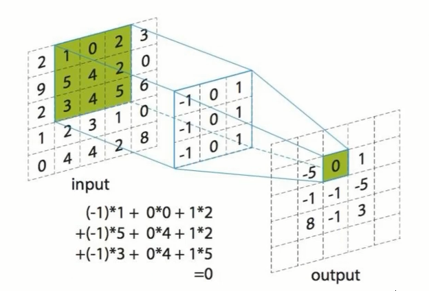
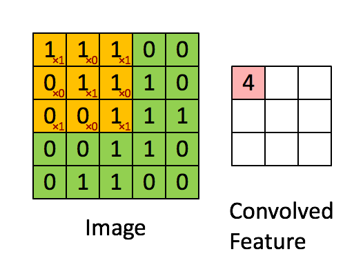
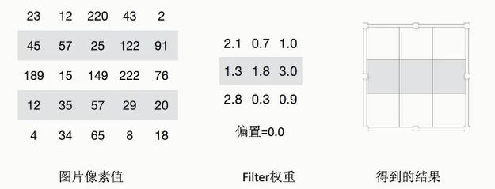
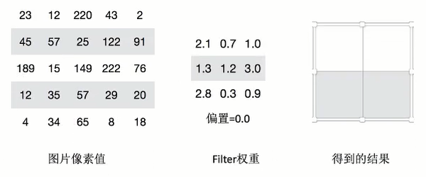
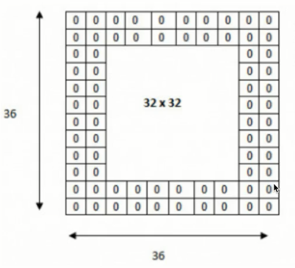
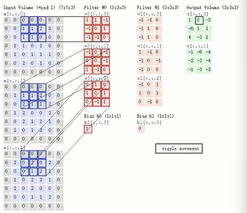
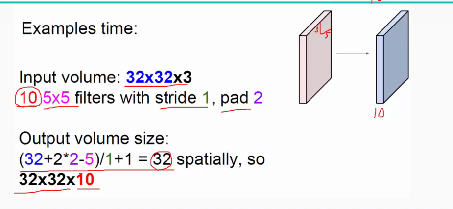
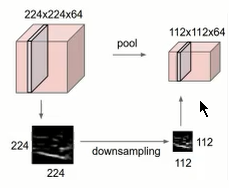
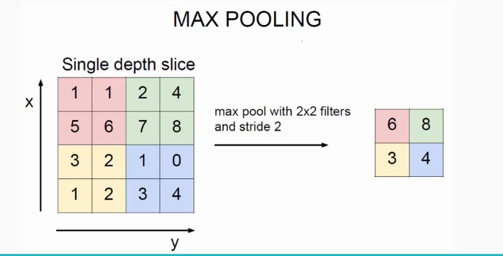

## CNN

CNN是由输入层、卷积层、池化层、激活层及全连接层组成

### 输入层

输入层即输入到神经网络的图像，须指明图像的形状。

形状为（batch，img_height， img_width， channel）

batch：一次输入到神经网络图像的数量

img_height，img_width：图像的高宽

channel：图像颜色的通道

还要指明图像被转化成数组后，每个元素的类型，可以是float32或者float64

### 卷积层

卷积运算的目的是特征提取，第一层卷积层可能只能提取一些低级的特征如边缘、线条和角等层级，更多层的网络能从低级特征中迭代提取更复杂的特征。

#### 卷积核

对输入的图片进行特征提取，提取特征的单位叫`卷积核`， 卷积核通过在原始图像上平移来提取特征，该层输出是多个卷积核的堆叠(如果一个卷积核被比喻层一张便签的话，输出就是那些便签没有被撕下来堆叠在一起的样子，虽然堆叠在一起，但是他们互相是分开的。在计算机内内存中应该是以多维数组的形式存的，一个卷积核的输出作为数组的一个元素)，该层有多少个卷积核就输出多少层。输出的高宽就是卷积核的高宽。所以该层要设置卷积核的大小即宽高，一般为（1，1），（3，3）或（5，5）。

#### 卷积核的计算

卷积核上每个元素的值是权重

动态图

 

#### 步长

需要去平移卷积核观察这张图片，需要的参数就是步长，即第二次移动卷积核的右边界或者下边界距离最近的左边或者上边的像素被卷积核处理过的边界的距离。
假设移动的步长为一个像素，那么最终这个人观察的结果以下图为例：
	5×5的图片，3×3的卷积大小去一个步长运算得到3×3的大小观察结果

假设移动的步长为2那么结果是这样
	5x5的图片，3×3的卷积大小去2个步长运算得到2×2的大小观察结果

#### 卷积核的个数

那么如果在某一层结构当中，不止用一个卷积核，用多个卷积核一起去处理输入的图像。那就得到多个经过不同的卷积核处理的结果。
不同的卷积核带的权重和偏置都不一样，即随机初始化的参数。的。但是只有这些吗？

#### 零填充

零填充就是在输出的图片像素外围填充一圈值为0的像素。

#### 多通道图片处理

如果是灰度图片，图片没有（B, G, R）三个通道，处理图片的卷积核也只是单个通道的，换成彩色图片的话，相应的卷积核也有三个通道分别提取对应通道的特征。每个通道每个元素带有权重，一个卷积核三个通道带有一个偏置。如下图（3，3，3）的卷积核，共有27个权重和一个偏置。

#### 输出大小

图像经过一层卷积层处理后输出大小计算：

输入：(height, width, channel)

卷积层的参数：filter_num = k, filter_size = (f_h, f_w), stride = s ,padding = p(valid->p = 0, same->p = 图像边界填充的像素的数量)

输出：(height2, width2, depth)

​	height2 = (height - f_h+ 2p)/s + 1

​	width2 = (width - f_w + 2p)/s + 1

​	depth = filter_num

#### 权值共享

 

如没有这个原则，则特征图由10个形为(32, 32, 1)的不同的特征图（卷积核处理输入图片的输出）组成，即每个特征图上有32 x 32 = 1024个神经元，每个神经元对应输入图像上一块(5, 5, 3)的区域(即卷积核处理的区域)，即一个神经元和输入图像的这块区域有75个连接，即75个权值参数，则共有75 x 1024 x 10=768000个权值参数，这是非常复杂的，因此卷积神经网络引入“权值”共享原则，即一个特征图上每个神经元对应的75个权值参数被每个神经元共享，这样则只需75 x 10=750个权值参数，而每个特征图的阈值也共享，即需要10个阈值，则总共需要750 + 10=760个参数。 

#### 卷积层参数

input：输入的图像，形状为（batch， height，width，channel），类型为float32或者float64

filter：卷积核的大小，形状为（filter_height, filter_width, in_channel, out_channel）

stride：卷积核移动的步长，形状为（1, stride, stride, 1）

padding：取样方式。

​	SAME：越过边缘取样，取样的面积和输入图像的像素宽度一致。取样超过图像的边缘，进行零填充。

​	VALID：不越过边缘取样，取样的面积小于输入人的图像的像素宽度。不填充。

[卷积层与池化层](https://blog.csdn.net/jia20003/article/details/80102922)

### 激活层

如果输入变化很小，导致输出结构发生截然不同的结果，这种情况是我们不希望看到的，为了模拟更细微的变化，输入和输出数值不只是0到1，可以是0和1之间的任何数，激活函数是用来加入非线性因素的，因为线性模型的表达力不够 。
这句话字面的意思很容易理解，但是在具体处理图像的时候是什么情况呢？我们知道在神经网络中，对于图像，我们主要采用了卷积的方式来处理，也就是对每个像素点赋予一个权值，这个操作显然就是线性的。但是对于我们样本来说，不一定是线性可分的，为了解决这个问题，我们可以进行线性变化，或者我们引入非线性因素，解决线性模型所不能解决的问题。
**常用的激活函数** 
激活函数应该具有的性质： 
（1）非线性。线性激活层对于深层神经网络没有作用，因为其作用以后仍然是输入的各种线性变换。。 
（2）连续可微。梯度下降法的要求。 
（3）范围最好不饱和，当有饱和的区间段时，若系统优化进入到该段，梯度近似为0，网络的学习就会停止。 
（4）单调性，当激活函数是单调时，单层神经网络的误差函数是凸的，好优化。 
（5）在原点处近似线性，这样当权值初始化为接近0的随机值时，网络可以学习的较快，不用可以调节网络的初始值。 
目前常用的激活函数都只拥有上述性质的部分，没有一个拥有全部的。下面列举一些常用的：
1）relu
	f(x) = max(0,x)

优点： 
x>0 时，梯度恒为1，无梯度耗散问题，收敛快； 
增大了网络的稀疏性。当x<0 时，该层的输出为0，训练完成后为0的神经元越多，稀疏性越大，提取出来的特征就约具有代表性，泛化能力越强。即得到同样的效果，真正起作用的神经元越少，网络的泛化性能越好;
运算量很小； 
缺点： 
如果后层的某一个梯度特别大，导致W更新以后变得特别大，导致该层的输入<0，输出为0，这时该层就会‘die’，没有更新。当学习率比较大时可能会有40%的神经元都会在训练开始就‘die’，因此需要对学习率进行一个好的设置。 

sigmoid缺点
采用sigmoid等函数，计算量相对大，而采用Relu激活函数，整个过程的计算量节省很多。在深层网络中，sigmoid函数反向传播时，很容易就会出现梯度消失的情况

### 池化层

池化层的作用是特征提取，通过减少输入特征图中不重要的像素，进一步减少神经网络的参数数量，降低复杂度。该层的输出不会改变图像的channel，会使输入图像的高宽减小。（如果输入是一张便签纸的话，输出不是多张便签纸堆叠在一起，而仍然是一个一张便签，只不过这个新的便签变小了，如果输入是n个便签堆叠在一起，则输出还是n个便签堆叠在一起，同样便签变小了)

#### 池化方法

主要有两种池化方法，分别是平均池化和最大池化。

##### 平均池化

现在不怎么用了方法是对每一个（2，2）的区域元素求和，再除以4，得到主要特征，而一般的filter取（2，2）,最大取（3，3）,stride取2，压缩为原来的1/4。

##### 最大池化

取窗口中最大值作为输出

 

#### 池化层输出大小

输出的宽高同卷积层，输出的depth个输入的batch一样。

#### 池化层参数

input_shape：上一层的输出。是一个4-D tensor，形状是（batch, height, width, channel）batch指输入多少个特征图。

ksize：池化层中单个窗口（类似于卷积层中的卷积核）的大小，形状是（1，	   ksize，ksize，1），一般是（1，2，2，1）

stride：步长大小，同卷积层的stride，形状为（1，stride，stride，1）

padding：同卷积层的padding。

### 全连接层

前面的卷积和池化相当于做特征工程，最后的全连接层在整个卷积神经网络中起到“分类器”的作用。