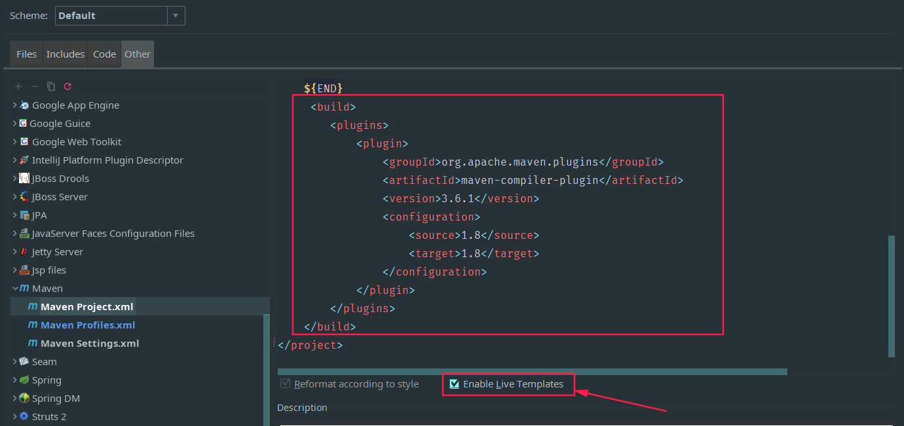

## 一、设置maven默认用jdk1.8编译项目

在pom.xml中添加下面这段配置

```xml
<build>
	<plugins>
		<plugin>
			<groupId>org.apache.maven.plugins</groupId>
             <artifactId>maven-compiler-plugin</artifactId>
             <version>3.6.1</version>
			<configuration>
				<source>1.8</source>
				<target>1.8</target>
			</configuration>
		</plugin>
	</plugins>
</build>
```

嫌每次都要添加麻烦的话，可以直接在文件模板的other->maven中修改Maven Project.xml这个文件，最后记住勾选`enable live template`。



## 二、解决idea用maven引入jstl和standard包网页依然报错的问题

这个问题的原因是jstl的依赖包和tomcat的jsp-api和servlet-api包冲突引起的。

之前简单引入jstl和standard包是这么引入的

```xml
<dependency>
　　<groupId>javax.servlet.jsp.jstl</groupId>
　　<artifactId>jstl-api</artifactId>
　　<version>1.2</version>
</dependency> 
<dependency>
    <groupId>taglibs</groupId>
    <artifactId>standard</artifactId>
    <version>1.1.2</version>
</dependency>
```

## 解决方法一：

为了解决冲突问题，就需要在jstl中排除那两个包，所有应该这么引入jar包。

```xml
<dependency>
            <groupId>javax.servlet.jsp.jstl</groupId>
            <artifactId>jstl</artifactId>
            <version>1.2</version>
            <exclusions>
                <exclusion>
                    <groupId>javax.servlet</groupId>
                    <artifactId>servlet-api</artifactId>
                </exclusion>
                <exclusion>
                    <groupId>javax.servlet.jsp</groupId>
                    <artifactId>jsp-api</artifactId>
                </exclusion>
            </exclusions>
        </dependency>

        <dependency>
            <groupId>org.apache.taglibs</groupId>
            <artifactId>taglibs-standard-spec</artifactId>
            <version>1.2.1</version>
        </dependency>
        <dependency>
            <groupId>org.apache.taglibs</groupId>
            <artifactId>taglibs-standard-impl</artifactId>
            <version>1.2.1</version>
        </dependency>
```

这里不能用standard的1.1.2版本了，否则还是会报错。

## 解决方法二：

还有一个正确的引入方法，觉得稍显复杂

```xml
<dependency>
            <groupId>javax.servlet.jsp.jstl</groupId>
            <artifactId>jstl-api</artifactId>
            <version>1.2</version>
            <exclusions>
                <exclusion>
                    <groupId>javax.servlet</groupId>
                    <artifactId>servlet-api</artifactId>
                </exclusion>
                <exclusion>
                    <groupId>javax.servlet.jsp</groupId>
                    <artifactId>jsp-api</artifactId>
                </exclusion>
            </exclusions>
        </dependency>
 
        <dependency>
            <groupId>org.glassfish.web</groupId>
            <artifactId>jstl-impl</artifactId>
            <version>1.2</version>
            <exclusions>
                <exclusion>
                    <groupId>javax.servlet</groupId>
                    <artifactId>servlet-api</artifactId>
                </exclusion>
                <exclusion>
                    <groupId>javax.servlet.jsp</groupId>
                    <artifactId>jsp-api</artifactId>
                </exclusion>
                <exclusion>
                    <groupId>javax.servlet.jsp.jstl</groupId>
                    <artifactId>jstl-api</artifactId>
                </exclusion>
            </exclusions>
        </dependency>
```

## 注意：

最后重要的是一定要在Project Structure的Artitfacts中将包put into /WEB-INF/lib中，否则还是会报错。

## 三、Mybatis 3.4.6框架及其依赖jar包的maven配置

```xml
		<!-- https://mvnrepository.com/artifact/org.mybatis/mybatis -->
		<dependency>
			<groupId>org.mybatis</groupId>
			<artifactId>mybatis</artifactId>
			<version>3.4.6</version>
		</dependency>
        <!-- https://mvnrepository.com/artifact/org.apache.ant/ant -->
        <dependency>
            <groupId>org.apache.ant</groupId>
            <artifactId>ant</artifactId>
            <version>1.9.6</version>
        </dependency>
        <!-- https://mvnrepository.com/artifact/org.apache.ant/ant-launcher -->
        <dependency>
            <groupId>org.apache.ant</groupId>
            <artifactId>ant-launcher</artifactId>
            <version>1.9.6</version>
        </dependency>
        <!-- https://mvnrepository.com/artifact/org.ow2.asm/asm -->
        <dependency>
            <groupId>org.ow2.asm</groupId>
            <artifactId>asm</artifactId>
            <version>5.2</version>
        </dependency>
        <!-- https://mvnrepository.com/artifact/cglib/cglib -->
        <dependency>
            <groupId>cglib</groupId>
            <artifactId>cglib</artifactId>
            <version>3.2.5</version>
        </dependency>
        <!-- https://mvnrepository.com/artifact/commons-logging/commons-logging -->
        <dependency>
            <groupId>commons-logging</groupId>
            <artifactId>commons-logging</artifactId>
            <version>1.2</version>
        </dependency>
        <!-- https://mvnrepository.com/artifact/org.javassist/javassist -->
        <dependency>
            <groupId>org.javassist</groupId>
            <artifactId>javassist</artifactId>
            <version>3.22.0-GA</version>
        </dependency>
        <!-- https://mvnrepository.com/artifact/log4j/log4j -->
        <dependency>
            <groupId>log4j</groupId>
            <artifactId>log4j</artifactId>
            <version>1.2.17</version>
        </dependency>
        <!-- https://mvnrepository.com/artifact/org.apache.logging.log4j/log4j-api -->
        <dependency>
            <groupId>org.apache.logging.log4j</groupId>
            <artifactId>log4j-api</artifactId>
            <version>2.3</version>
        </dependency>
        <!-- https://mvnrepository.com/artifact/org.apache.logging.log4j/log4j-core -->
        <dependency>
            <groupId>org.apache.logging.log4j</groupId>
            <artifactId>log4j-core</artifactId>
            <version>2.3</version>
        </dependency>
        <!-- https://mvnrepository.com/artifact/ognl/ognl -->
        <dependency>
            <groupId>ognl</groupId>
            <artifactId>ognl</artifactId>
            <version>3.1.6</version>
        </dependency>
        <!-- https://mvnrepository.com/artifact/org.slf4j/slf4j-api -->
        <dependency>
            <groupId>org.slf4j</groupId>
            <artifactId>slf4j-api</artifactId>
            <version>1.7.25</version>
        </dependency>
        <!-- https://mvnrepository.com/artifact/org.slf4j/slf4j-log4j12 -->
        <dependency>
            <groupId>org.slf4j</groupId>
            <artifactId>slf4j-log4j12</artifactId>
            <version>1.7.25</version>
            <scope>test</scope>
        </dependency>
```

