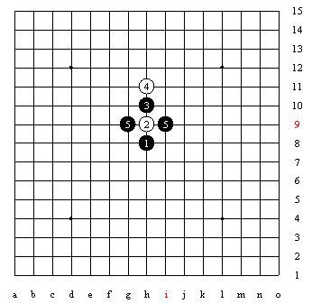
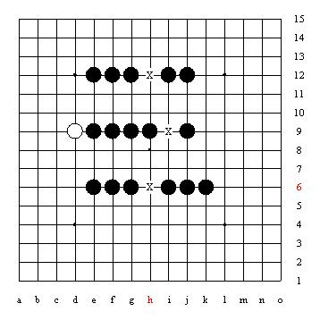

# 五子棋比赛规则

## 中国大学生计算机博弈大赛五子棋规则

### 规则内容

参见[这里](http://computergames.caai.cn/jsgz16.html)

棋盘：15×15的棋盘。

棋子：黑白两种棋子。

棋规：

（1）先后手的确定：可由大赛组委会抽签或对局前猜先。

（2）开局：包括指定开局、自由开局两种，全国博弈大赛拟采用指定开局模式。

（3）对局双方各执一色棋子，黑先、白后交替下在棋盘的交叉点上，棋子下定后，不得向其它点移动，不得从棋盘上拿起另落别处。每次只能下一子（指定开局、三手交换和五手N打、行使PASS权除外）。 在采用指定开局时黑方的第一枚棋子应下在天元上。同时在下面的对局中应执行三手交换和五手N打及禁手规则。

（4）指定开局：指黑方决定了前三个棋子落于何处，其中包括两个黑子和一个白子，一般由黑方完成。黑方应同时给出第五手需要的打点数量。采用指定开局办法的比赛均采用斜指或直指开局（26种），黑方第一子应落在天元处（黑1）。黑方还决定了白方的第一子的落点（白2）。黑方的第二子（黑3），应落在围绕天元点5线×5线而形成的以天元为正中的由交叉点组成的区域内。

（5）自由开局：由双方轮流行棋共同决定开局前3个棋子落于何处。即黑方落第一子（黑1）、白方落第二子（白2），黑方落第三子（黑3）。采用此种开局时一般双方的对局数为偶数，或采用其他附加条款对黑方的先行优势进行限制。而不采用指定开局中使用的三手交换和五手N打，也可不执行禁手规则。

（6）三手交换 在采用指定开局的对局中，在黑3之后，白方在应白4之前，可选择黑棋或白棋，每盘棋只有一次选择机会，如提出交换黑、白方，则 黑方必须同意交换。

（7）五手N打黑方在指定开局的同时要给出本局盘面黑5时所需的打点数量，此后无论对局者谁执黑棋，都需要在落第五手时按照要求的打点数量，在盘面上的空白交叉点上放置相应数量且位置不同形的黑子，白方只能在这些黑子中留下一个黑子作为黑5。

（8）禁手对局中如果使用三三禁手、四四禁手、长连禁手，将被判负。

（9）终局胜负判定：
最先在棋盘上形成五连的一方为胜。白棋长连视同五连。黑方出现禁手，则判白方胜。如白方在黑方出现禁手后，未立即指出而又落下一白子，则黑方禁手不再成立。若黑方走出长连禁手，白方只要是在终局前指出此禁手，判白方胜。黑方五连与禁手同时形成，禁手失效，黑方胜。对局中，一方出现下列情况之一判负：比赛对局中移子或棋局散乱、超过规定时限、人为辅助计算、主动停止计时。对局中出现下列情况之一，判和棋：对局双方同一回合均放弃行棋权、全盘下满，且无胜局出现、双方比赛同时超时。

### 指定开局

指定开局是五子棋规则中设立的特殊规定之一。

对局开始后的前三着所形成的布局称开局。前三着落的两黑一白子，本应黑白双方完成，但职业五子棋比赛规定，**这开局的前三着棋均由黑方来完成，又称黑方指定开局**。指定开局的落子范围、分类、不同棋形的名称均做了确切的规定。因此，我们也可以这样说，先走方有选择开局的权利。

从棋盘范围来讲，开局三着的落子要落在以天元为中心的5横5纵线交叉而成的25个点内，如图：

**第一手黑子必须放天元，第二手白子必须落在与天元直接相连的周围的8个点上**，如图：

第二手白子落在与天元阴线相连的斜侧方向点上的开局称斜指开局。斜侧方向共有4个点可放白子，这4个点两两对称，实质上放任何一个点上的白子与其他三点上放白子行棋作用均相同。为了研究简洁、不重复，在论述开局内容时，我们通常只以天元右上侧方放白子为例研究开局，不再重复研究3次。

第二手白子落在与天元阳线相连的正侧方向点上的开局称直指开局。同上论述，我们通常只以天元上方放白子为例来研究开局，不再重复3次。

第三手黑子落在开局范围内后，便形成了完整的开局棋形，去掉由于对称而作用相同的一些重复部分，直指开局，斜指开局各13种。这26种开局均以“星”和“月”命名。

开局中的两枚黑子的基本棋形大致分为桂(日字马步形)、间(在一条阳线或阴线上间隔一个点)、连(在一条阳线或阴线上无间隔)三种类型。在各种开局名称中，“间打”的名称用“星”表示，“桂打”和“连打”的名称用“月”表示。

直指开局(D)：英文为Direct(直接的)，白2选择阳线上与黑1相邻的防守点。

斜指开局(I)：英文为Indirect(间接的)，白2选择阴线上与黑1相邻的防守点。

以上这26种开局就是规则中规定的，在国际国内正式五子棋比赛指定的可使用的开局，并且是必须使用的开局，如果黑方在开局时未按指定开局去行棋，均可被判罚违例的。

### 三手交换

三手可交换是五子棋规则中设立的特殊规定之一，简称三手交换或三手可换。

三手可交换是指，当盘面下出三手棋时。白方在应第四手棋前，可选择此开局使用黑棋还是白棋。如果白方提出交换黑白棋，则黑方必须同意，一局中只能有一次交换机会。

三手可交换是作为规则内容出现的，出现的原因是由于棋手对开局的深入研究，发现有的开局几乎成必胜开局了，有的开局黑方优势较大，设立三手可交换规则限制了黑方开始时走出太强的开局。因此外也可以说，后走方有选择执黑还是执白的权利。

### 五手N打

黑方在指定开局的同时要给出本局盘面黑5时所需的打点数量，此后无论对局者谁执黑棋，都需要在落第五手时按照要求的打点数量，在盘面上的空白交叉点上放置相应数量且位置不同形的黑子，白方只能在这些黑子中留下一个黑子作为黑5。

以五手2打为例：

黑方在下盘面第五手时，必须在盘面上的两个空白交叉点上各放一枚黑子，此两黑子在位置上不能同形，或者说不能对称；需要注意的是，对称指的是这黑白一共五个棋子全部看起来对称，而不是只看这时的四个黑棋。之后，由白方选择后，拿去一子，留下一子。一般此两黑子放子的方法是反放棋子，就是凸面朝下，白方先拿走一黑子后，把留下的黑子翻正过来。(两面凸的棋子例外)

设立五手两打规则的原因，是在理论上使黑棋方不能抢占到第五手棋的最强点，从而进一步削弱黑棋先行的优势，使先后手子力更趋于平衡。

如图就是两个对称的五手两打点的例子，这样的**两打点是禁止走的**，因为对称的两打点实际上几乎可以看作是一个点，它们之间的变化是非常相似的(上图是轴对称，下图是中心对称)：

    
    

### 禁手

#### 基本概念

**禁手分类：**

三三禁手：黑棋一子落下同时形成两个或两个以上的活三，此子必须为两个活三共同的构成子，即**两个活三同时形成**；

四四禁手：黑棋一子落下同时形成两个或两个以上的冲四或活四；

四三三禁手：黑方一步使一个四，两个活三同时形成，归为三三禁手；

四四三禁手：黑方一步使两个四，一个活三同时形成，归为四四禁手；

长连禁手：棋一子落下形成一个或一个以上的长连。注意：白棋出现长连与连五同等作用，即白棋出现长连也将获胜。

**构成禁手的基本子力要素：**

活三：本方再走一着可以形成活四的三；

活四：有两个点可以成五的四；

冲四：只有一个点可以成五的四；

长连：在棋盘上的阳线和阴线任意一条线上，形成的5个以上同色棋子不间隔的相连。

**注意：**

黑方五连与禁手同时形成，禁手失效，黑方胜

#### 禁手示例

##### 三三禁手

A点是两个连活三的三三禁手。

B点是两个活三和一个冲四的三三禁手，平时也称四三三禁手，这种禁手，实战中有时容易看不到另一个活三，而错误看成四三胜而落在这个禁手上面，遗憾的被对方指出禁手而输棋，这是广大初学者要特别注意的。

C点是两个阴线跳活三的三三禁手，这种三三禁手隐蔽性较强，初学者有时不易发觉。

D点是三个活三形成的三三禁手，平时也称三三三禁手。一般情况下，图中用字母X表示禁手点，这里由于要说明不同的禁手棋形，所以就用不同的字母表示了。

为什么一定要加上“此子必须是两个活三的共同构成子”这句话呢？请看下面反例图

A点黑棋一子落下同时形成了两个活三，注意三个黑1组成的三，在黑棋A点落子后由眠三(假活三)成为活三，这是由于A点落下黑子后，B点被解禁了。但A点落子不是这两个活三的共同构成子，所以A点不是三三禁手。

此图下面的C点落下黑棋后，也形成了两个活三；但这两个活三是先后形成，不是同时形成的，所以这个C点也不是三三禁手。

##### 四四禁手

A点是黑棋形成两个冲四的四四禁手。

B点是黑棋形成的一个活四和一个冲四的四四禁手。

C点是三个四形成四四禁手，平时也称四四四禁手。

D点是两个四和一个活三形成的四四禁手，平时也称四四三禁手。

四禁手有在同一条线上的，这是与三三禁手明显的区别。如图：

下图中的四个组合棋形中，四个X点，黑棋分别都同时形成了两个冲四，是四四禁手，有趣的是每两个冲四都是在同一条线上形成的，这在三三禁手中是没有的，也是四四禁手比较独特的地方。

##### 长连禁手

