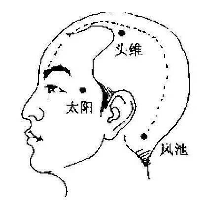

# 偏头痛

## 症状

- 怕冷，怕吹风，哪怕是一丝丝冷气经过都会异常的敏感到。
- 劳累后头痛加剧。另外偏头痛的病人往往怕光、怕声音或者有恶心呕吐。
- 在安静、黑暗的环境或睡眠后头痛可以缓解，常常会反复发作，间歇期正常。
- 单侧头部胀痛 跳痛为主，严重的累及眼眶周围胀痛。并且可能出现头晕恶心、视物模糊、注意力不集中、嗜睡的现象。

## 诱因

- 着凉感冒。
- 上火及吃过多冷饮。
- 脊椎疲劳导致压迫神经。
- 睡眠不足或睡眠质量低。
- 慢性鼻炎或智齿影响神经。
-  长期低头伏案引起的颈椎肌肉僵硬紧张或者颈椎曲度变直。
- 颈椎间盘蜕变 、小关节错位、 椎间隙变窄、 或者钩椎关节增生都会直接卡压或者牵拉扭转椎动脉。

## 抑制、缓解

（来源知乎，以文字长短排序，不涉及重要性）

1、[偏头痛怎么办？ - 陈沙拉的回答 - 知乎](https://www.zhihu.com/question/23207486/answer/83189997)

- 长期坚持运动，跑步。
- 掐户口长时间点可能有效。
- 摇摇头，头痛加剧：属于因血管扩张而导致的偏头痛，冷敷或者是躺下静养较有效。吃布洛芬一类药品更管用。
    摇头后，头痛程度不变：属于因疲劳或肌肉紧张导致的头痛，泡个澡或是做个按摩，暖和起来就会好不少。吃阿司匹林一类药品更管用。姨妈痛属于前者，吃布洛芬。

2、[很频繁的偏头痛怎么办？ - 苗邦的回答 - 知乎](https://www.zhihu.com/question/52489203/answer/131390115)

- 坐车不能玩手机。
- 洗澡完必须吹头发。
- 早中晚用冷水洗鼻子（鼻炎患者）。
- 避免冷吃清淡不能热气上火，禁止吃可可含量高的巧克力。
- **长时间伏案或对电脑要起身运动脖子，左转转，右转转，反复几十次。**
- 特别注意两个季节交替的时间，在转季前后几天宁可热着也不要冷着，为防止颈椎着凉，可以穿中领或高领的衣服。
- **坚持运动（跑步）**，喝鲜奶，提高免疫力，减少着凉感冒频率间接减少偏头疼发作次数睡觉衣服遮住关节膝盖，防止着凉。

另外，答主在每次发生偏头疼的时候或事后，都记录下发生偏头疼的时间、症状、判断原因。然后在接下来的日子有意去纠正。

注意防寒保暖和极端劳累。

3、[偏头痛怎么办？ - 至诚金方的回答 - 知乎](https://www.zhihu.com/question/23207486/answer/136001131)

- 穴位按摩

    取穴：太阳穴、风池穴、阳陵泉、头维穴、陷谷穴。

    方法：以点按的手法，按12秒后，放松，再点按1~2秒，每穴如此反复操作1分钟。

    作用：有效改善大脑血液循环，对缓解头晕头痛具有很好的疗效。

    （但这个[回答](https://www.zhihu.com/question/23207486/answer/216888278)提到按摩相关的会暂时止疼，但是会让之后的疼痛更加剧烈）

- 关于吃药

    建议到专科医生那里咨询后再使用止痛药物。

    急性偏头痛发作时，头痛的程度一般是逐渐加重的。如果头痛已经加重了，这时服用止痛药物，不仅肠胃吸收不好，而且因为偏头痛常伴有恶心呕吐，药物可能还未消化就被吐出来，根本起不到止痛效果。因此，**止痛药的服药时间应该选在头痛刚刚开始时，或者感觉头痛即将发生时**。

    不宜长期过量使用止痛药物。因为过量食用止痛药物也可能引起头痛。通常来说，一天只能吃1~2次，一次只能吃一片，不要连续吃止痛片超过3天。

4、[偏头痛怎么办？ - 锦心狐的回答 - 知乎](https://www.zhihu.com/question/23207486/answer/216888278)

- 咖啡因对偏头疼有比较明显的抑制作用（**千万别加奶，酪氨酸反而会诱发**）。

- 良好的睡眠（不一定能做到）；避免噪音环境；避免听歌工作；或者连续多线程工作。

- **先兆期禁止：**不要吃[3C类食物](https://baike.baidu.com/item/3C%E9%A3%9F%E7%89%A9/11040998)，不要柑橘类食物，**不要吃高糖分食物，不要吃带奶制品的食物**。不要喝酒。（吃了这些基本大概率会继续发作）。去室外通风区，在家可以洗个澡，如果有机会就睡觉（深睡眠，浅睡眠反而会加重）。

    注：3C食物指奶类、巧克力和柑橘类食物，都含有一种名为酪胺酸的物质，它会造成血管痉挛，由此而导致头痛的产生。

- **疼痛时期禁忌：**不要用手按摩头皮，或者太阳穴；**不要做任何形式的头部按摩**；不要揉眼睛，挤压眼球会让眼压升高更快。(按摩相关的会暂时止疼，但是会让之后的疼痛更加剧烈)。

- **曲坦类药物**，国外已经非常普及了。曲坦类的药物种类繁多，已经有两代药物，近10种之多。国内早期被引进舒马曲坦，不久前利扎曲坦也已经到位，国内叫欧立停。效果显著(笔者常备药物)。
- **阿司匹林，**可以比较有效缓解偏头疼。预防、先兆、疼痛这三个时期都可以吃。而且是唯一已经被各类疾病长期临床用过的药，安全性暂时看是最高的。不少老人因为各类疾病都长期服用。如果特别担心安全性，建议吃阿司匹林。

5、[偏头痛是什么感觉？ - 涛吴的回答 - 知乎](https://www.zhihu.com/question/27402240/answer/86642546)

- 药可以轮流吃，但最好不要混着吃。
- 吃药要趁早，有一点点可以明显确认症状就吃。
- 偏头痛专用药：曲坦（Triptan）类，常见的曲坦类药物有舒马普坦 （Sumatriptan）、阿莫曲坦（Almotriptan）、那拉曲坦（Naratriptan ）之类，但是价格较高。

6、评论区

- 多运动真的有用。
- 别熬夜，保持好心情。
- 吃[散列通](https://baike.baidu.com/item/%E6%95%A3%E5%88%97%E9%80%9A/7735537?fr=aladdin)有效，但是注意副作用，不可长时间服用。
- 热水，促进血液循环。热水敷颈椎、脖子，热水泡脚或洗个热水澡。

